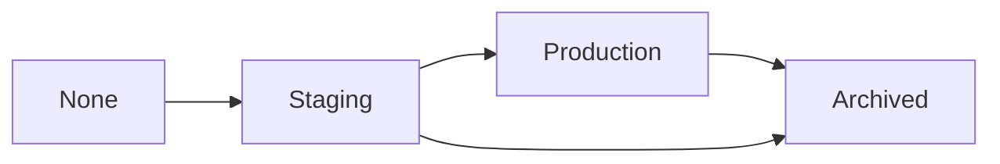

# Model Registry 与生产部署

Model Registry 在 Artifact 之上提供模型生命周期管理，从实验到生产的最后一公里。

---

## Model Registry 是什么？

**类比**：Docker Registry 管理镜像版本 → Model Registry 管理模型版本。

| **概念** | **说明** | **类比** |
| --- | --- | --- |
| Registered Model | 一个模型的所有版本集合 | Docker Image |
| Model Version | 某次训练产出的具体模型 | Docker Tag |
| Stage | 模型所处的生命周期阶段 | Dev / Staging / Prod |
| Alias | 语义化标签，如 `champion` | Git Tag |

## 注册模型

### 方式一：训练时直接注册

```python
import wandb

run = wandb.init(project="llm-sft", job_type="train")

# 训练完成后
model_artifact = wandb.Artifact(
    "llama3-8b-sft",
    type="model",
    metadata={
        "base_model": "meta-llama/Llama-3-8B",
        "val_loss": 0.85,
        "method": "LoRA r=16",
    },
)
model_artifact.add_dir("output/checkpoint-best/")
run.log_artifact(model_artifact)

# 注册到 Model Registry
run.link_artifact(
    artifact=model_artifact,
    target_path="model-registry/llama3-8b-sft",  # Registered Model 名称
)

wandb.finish()
```

### 方式二：事后注册已有 Artifact

```python
api = wandb.Api()
artifact = api.artifact("my-team/llm-sft/llama3-8b-sft:v3")

# 链接到 Registry
artifact.link(
    target_path="model-registry/llama3-8b-sft",
    aliases=["candidate"],
)
```

## 阶段管理

模型典型生命周期：



```python
api = wandb.Api()

# 获取 Registered Model
reg_model = api.registered_model("my-team/model-registry/llama3-8b-sft")

# 查看所有版本
for v in reg_model.versions:
    print(f"v{v.version}: stage={v.stage}, aliases={v.aliases}")

# 修改阶段
version = reg_model.versions[0]
version.set_stage("production")

# 添加别名
version.add_alias("champion")
```

## Webhook 自动化

Model Registry 支持 Webhook，模型状态变更时自动触发：

| **事件** | **触发场景** | **典型用途** |
| --- | --- | --- |
| New Version | 新模型版本注册 | 触发自动评估 |
| Stage Change | 阶段切换（如 staging → production） | 触发部署流水线 |
| Alias Change | 别名变更 | 通知相关团队 |

### 部署流水线集成示例

```python
# deploy.py — 由 Webhook 触发
import wandb
import subprocess

def deploy_model(model_name: str, version: str):
    api = wandb.Api()
    artifact = api.artifact(f"my-team/model-registry/{model_name}:{version}")

    # 下载模型
    model_dir = artifact.download(root="/models/latest")

    # 触发部署（示例：更新 vLLM 服务）
    subprocess.run([
        "kubectl", "set", "image",
        "deployment/llm-server",
        f"llm-server=llm-image:v{version}",
    ])

    print(f"✅ Deployed {model_name}:{version}")

# Webhook payload 中提取信息并部署
deploy_model("llama3-8b-sft", "v3")
```

## CI/CD 集成

### GitHub Actions 示例

```yaml
# .github/workflows/model-eval.yml
name: Model Evaluation

on:
  repository_dispatch:
    types: [wandb-model-registered]

jobs:
  evaluate:
    runs-on: ubuntu-latest
    steps:
      - uses: actions/checkout@v4

      - name: Download model
        env:
          WANDB_API_KEY: $ secrets.WANDB_API_KEY
        run: |
          pip install wandb
          python -c "
          import wandb
          api = wandb.Api()
          artifact = api.artifact('$ github.event.client_payload.artifact ')
          artifact.download(root='./model')
          "

      - name: Run benchmarks
        run: python eval/run_benchmarks.py --model-path ./model

      - name: Upload results
        run: python eval/upload_results.py
```

## 生产环境查询模型

```python
import wandb

def load_production_model(model_name: str):
    """从 Registry 加载当前 production 模型。"""
    api = wandb.Api()
    reg_model = api.registered_model(f"my-team/model-registry/{model_name}")

    # 查找 production 阶段的版本
    for v in reg_model.versions:
        if v.stage == "production":
            artifact = api.artifact(
                f"my-team/model-registry/{model_name}:v{v.version}"
            )
            return artifact.download()

    raise ValueError(f"No production version found for {model_name}")

# 或通过别名直接获取
def load_champion_model(model_name: str):
    api = wandb.Api()
    artifact = api.artifact(f"my-team/model-registry/{model_name}:champion")
    return artifact.download()
```

---

*← 返回：[[1数据与模型版本管理（Artifacts）]]*
