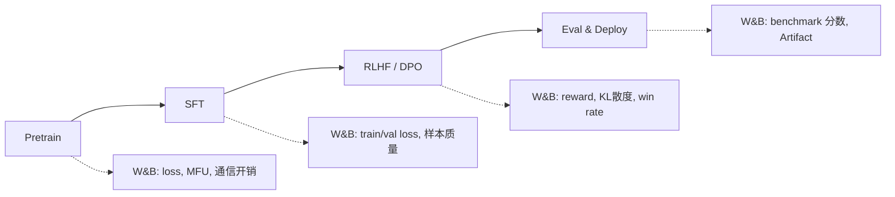

# LLM 训练/微调/对齐实战集成

将 W&B 深度集成到 LLM 的 Pretrain → SFT → RLHF/DPO 全流程中，覆盖主流框架的实战用法。

---

## LLM 训练流程与 W&B 切入点



## HuggingFace Trainer 集成（零代码）

Trainer 原生支持 W&B，只需设置环境变量：

```python
import os
os.environ["WANDB_PROJECT"] = "llm-sft"
os.environ["WANDB_LOG_MODEL"] = "checkpoint"  # 自动上传 checkpoint

from transformers import TrainingArguments, Trainer

args = TrainingArguments(
    output_dir="./output",
    report_to="wandb",            # 启用 W&B
    run_name="llama3-8b-lora-r16", # Run 名称
    logging_steps=10,

    # 训练参数
    num_train_epochs=3,
    per_device_train_batch_size=4,
    gradient_accumulation_steps=8,
    learning_rate=2e-4,
    warmup_ratio=0.03,
    lr_scheduler_type="cosine",
)

trainer = Trainer(
    model=model,
    args=args,
    train_dataset=train_dataset,
    eval_dataset=eval_dataset,
)
trainer.train()
```

自动记录的指标：

- `train/loss`, `train/learning_rate`, `train/grad_norm`
- `eval/loss`, `eval/runtime`
- GPU 利用率、内存、吞吐量

## TRL（SFT + DPO + PPO）集成

### SFT

```python
from trl import SFTTrainer, SFTConfig

config = SFTConfig(
    output_dir="./sft-output",
    report_to="wandb",
    run_name="sft-llama3-8b",
    num_train_epochs=3,
    per_device_train_batch_size=4,
    logging_steps=10,
)

trainer = SFTTrainer(
    model=model,
    args=config,
    train_dataset=dataset,
    tokenizer=tokenizer,
)
trainer.train()
```

### DPO

```python
from trl import DPOTrainer, DPOConfig

config = DPOConfig(
    output_dir="./dpo-output",
    report_to="wandb",
    run_name="dpo-llama3-8b",
    beta=0.1,              # KL 惩罚系数
    num_train_epochs=1,
    logging_steps=10,
)

# W&B 自动记录:
# - rewards/chosen, rewards/rejected
# - rewards/margins
# - logps/chosen, logps/rejected
# - train/loss
trainer = DPOTrainer(
    model=model,
    ref_model=ref_model,
    args=config,
    train_dataset=dpo_dataset,
    tokenizer=tokenizer,
)
trainer.train()
```

### PPO / RLHF

```python
from trl import PPOTrainer, PPOConfig

config = PPOConfig(
    model_name="llama3-8b-sft",
    log_with="wandb",  # PPO 使用 log_with 而非 report_to
    batch_size=64,
    mini_batch_size=16,
)

# W&B 自动记录:
# - ppo/loss/policy, ppo/loss/value
# - ppo/mean_scores (reward model 分数)
# - ppo/kl_divergence
trainer = PPOTrainer(
    config=config,
    model=model,
    ref_model=ref_model,
    tokenizer=tokenizer,
)
```

## 自定义 W&B Callback

需要记录额外指标时：

```python
from transformers import TrainerCallback

class WandBCustomCallback(TrainerCallback):
    """自定义 W&B 回调，记录额外指标。"""

    def on_evaluate(self, args, state, control, metrics=None, **kwargs):
        if metrics:
            # 记录自定义评估指标
            import wandb
            wandb.log({
                "custom/perplexity": 2 ** metrics.get("eval_loss", 0),
                "custom/throughput": state.num_input_tokens_seen / state.total_flos,
            }, step=state.global_step)

    def on_log(self, args, state, control, logs=None, **kwargs):
        if logs and "loss" in logs:
            import wandb
            # 记录 loss spike 检测
            wandb.log({
                "monitor/loss_spike": logs["loss"] > 5.0,
            }, step=state.global_step)

# 使用
trainer = Trainer(
    model=model,
    args=args,
    callbacks=[WandBCustomCallback()],
)
```

## 分布式训练注意事项

<aside>
⚠️

**多 GPU / 多节点训练时**，默认只有 rank 0 会初始化 W&B Run，避免重复记录。DeepSpeed / FSDP 均遵循此行为。

</aside>

```python
# 如果需要每个 rank 独立记录（如调试通信性能）：
import os
if int(os.environ.get("RANK", 0)) == 0:
    wandb.init(project="llm-pretrain", group="8xA100-run1")

# 或使用 group 将所有 rank 归组
wandb.init(
    project="llm-pretrain",
    group="8xA100-run1",
    name=f"rank-{os.environ['RANK']}",
)
```

## 子页面导航

- **[[2HuggingFace Trainer + W&B 深度集成]]** → Callback 全解、自定义 log、Checkpoint 管理
- **[[SFT / DPO / RLHF 对齐训练监控]]** → 对齐专属指标解读、异常告警策略
- **[[4分布式训练场景下的 W&B 配置]]** → DeepSpeed / FSDP / Megatron 集成细节

---

*← 上一节：[[5可视化与协作报告（Reports）]]*

[2HuggingFace Trainer + W&B 深度集成](2HuggingFace%20Trainer%20+%20W&B%20深度集成.md)

[SFT / DPO / RLHF 对齐训练监控](3SFT%20DPO%20RLHF%20对齐训练监控.md)

[4分布式训练场景下的 W&B 配置](4分布式训练场景下的%20W&B%20配置.md)
