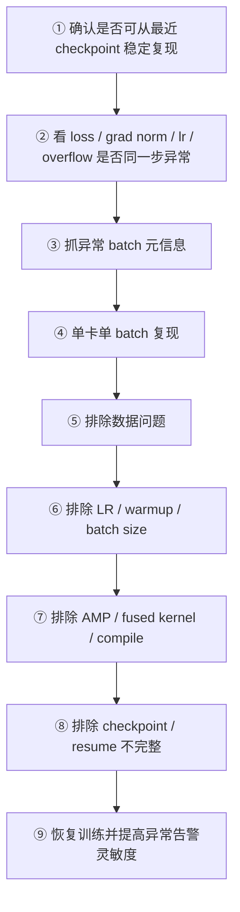

# 14. 标准排障流程

训练出现异常时的标准化 9 步定位法——按顺序执行，逐步缩小问题范围。

---

## 9 步排障流程

---

## 各步详解

### ① 确认复现性

- 从最近安全 checkpoint resume，跑到同一位置
- **能复现** → 问题是确定性的，可以精确定位
- **不能复现** → 可能是随机硬件问题、通信抖动，需多次尝试

### ② 多指标同步检查

在异常 step 同时检查：

- `loss`：是否突变
- `grad norm`：是否异常
- `lr`：scheduler 是否正常
- `overflow count`：是否 AMP 问题

> 多指标同步异常 → 大概率是同一根因
>

### ③ 抓 batch 元信息

记录异常 step 的 `sample_ids / shard / file / offset / seq_len`

### ④ 单卡复现

- 单 GPU + 同一 batch + 关闭 dropout
- 如果单卡也炸 → 排除通信问题
- 如果单卡正常 → 多卡通信 / 同步问题

### ⑤ 排除数据

- 替换该 batch 为已知正常 batch
- **恢复** → 数据问题，清洗对应数据源
- **仍异常** → 继续下一步

### ⑥ 排除超参

依次尝试：

1. 降 LR 50%
2. 延长 warmup
3. 收紧 grad clipping

### ⑦ 排除实现

逐个关闭：

1. `torch.compile`
2. fused kernels
3. flash attention
4. 切换 precision（bf16 ↔ fp32）

### ⑧ 排除 resume

- 检查 checkpoint 所有组件是否完整
- 验证 optimizer state / RNG state / dataloader position

### ⑨ 恢复并加固

- 从安全 checkpoint 恢复
- 提高告警灵敏度（降低 spike 检测阈值）
- 增加异常自动保存的信息量
