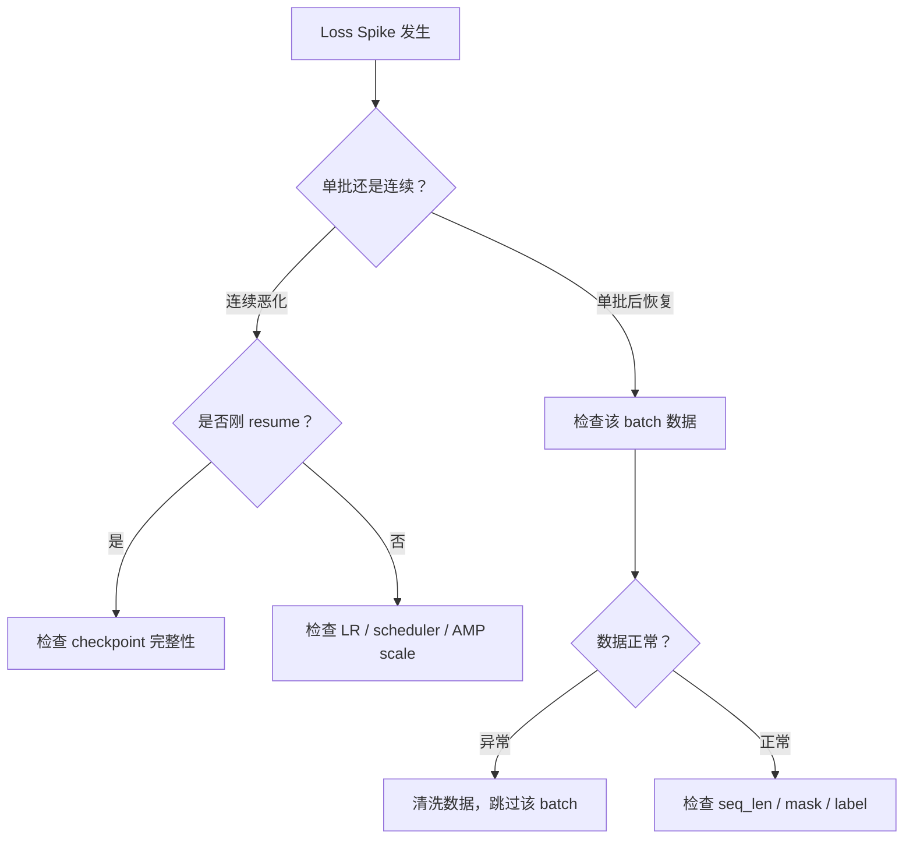

# 5. Loss Spike 诊断

Loss Spike = 训练过程中 loss 突然异常飙升。它是训练不稳定的最直接信号，需要立刻定位原因。

---

## 常见来源

按出现频率排序：

1. **坏 batch**：脏数据、空标签、异常长样本、乱码
2. **LR 过大**：update 幅度超出模型承受范围
3. **warmup 不足**：早期 optimizer 状态未稳定
4. **混精 overflow**：fp16 下 loss scale 跌至极低
5. **异常长样本**：单条序列占用大量显存 + loss 异常
6. **mask / label shift bug**：标签与输入对不齐
7. **optimizer state 损坏**：Adam m/v 值异常
8. **resume 不完整**：checkpoint 缺少部分状态
9. **数据分布突然切换**：多数据源混合时某源比例突变

---

## 快速归因

<aside>
🎯

**三条判别规则**：

- **单批爆炸后恢复** → 先查 batch（大概率是脏数据）
- **连续多批恶化** → 先查 LR / scheduler / overflow
- **resume 后立刻炸** → 先查 checkpoint 完整性
</aside>

---

## 归因决策树

→ 定位到具体 batch 的方法见 [[异常 Batch 定位]]