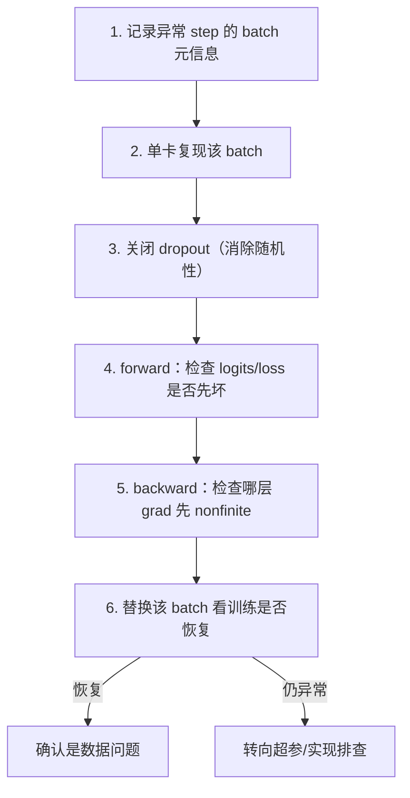

# 6. 异常 Batch 定位

当 loss spike 发生时，最关键的一步是定位到**具体是哪个 batch** 触发了异常。这需要完善的日志体系和标准化的复现流程。

---

## 必做日志

每个 training step 必须记录以下信息，异常时才能回溯：

| 字段 | 说明 | 用途 |
| --- | --- | --- |
| `global_step` | 全局训练步数 | 定位时间线 |
| `micro_step` | 梯度累积内的子步 | 精确到累积内哪一批 |
| `sample_ids / shard / file / offset` | 数据来源元信息 | 回溯到原始文件 |
| `seq_len max/min/mean` | 当前 batch 序列长度统计 | 检测异常长样本 |
| `loss` | 当前 step loss | spike 检测 |
| `grad_norm` | 裁剪前梯度范数 | 爆炸检测 |
| `lr` | 当前学习率 | 排除 scheduler 问题 |
| `scale (fp16)` | GradScaler 的 loss scale | overflow 诊断 |
| `tokens/sec` | 吞吐量 | 检测 IO / 通信瓶颈 |

---

## 触发器

自动检测异常的三个条件（满足任一即触发告警 + 保存上下文）：

1. `loss > rolling_mean + k * std`（k 通常取 3~5）
2. `grad_norm > threshold`（根据历史统计设定）
3. `nonfinite loss / grad`（NaN / Inf 直接触发）

---

## 定位流程

→ 详见子页面 [[异常 Batch 定位 Python 实战]]

[异常 Batch 定位 Python 实战](异常%20Batch%20定位%20Python%20实战.md)