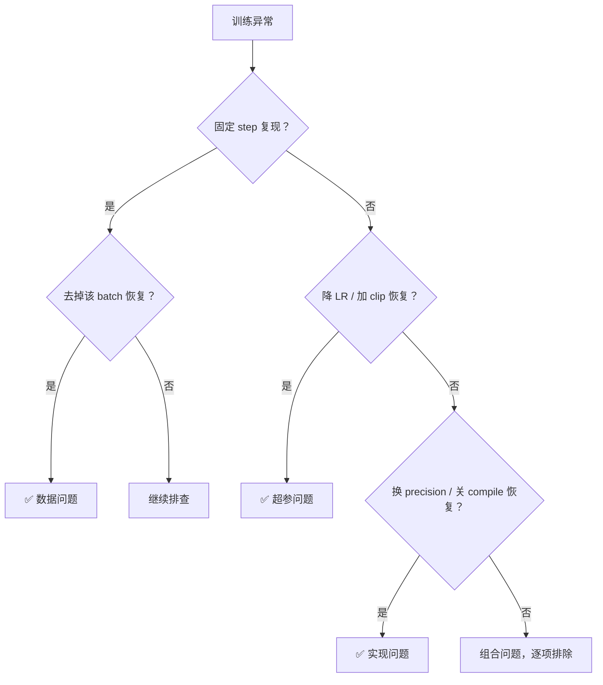

# 8. 数据问题 vs 超参问题 vs 实现问题

训练出现异常时，首先要判断问题来自**数据**、**超参**还是**实现**——不同根因的修复路径完全不同。

---

## 快速分类对照表

| 特征 | 🗂️ 数据问题 | 🎛️ 超参问题 | 🔧 实现问题 |
| --- | --- | --- | --- |
| **复现模式** | 固定少数 step 复现 | 多处随机 step 都可能炸 | 特定条件必炸 |
| **排除验证** | 去掉某批/某文件即恢复 | 降 LR / 延 warmup / 加 clip 后恢复 | 换 precision / 关 compile 后恢复 |
| **典型表现** | 样本过长 / 空标签 / 乱码 / 坏音频图片 | 同数据不同 seed 都不稳 | resume 必炸 / 多卡炸单卡不炸 |
| **数据源相关** | 仅某数据源触发 | 所有数据源均可触发 | 与数据无关 |
| **环境相关** | 无 | 无 | compile / fused kernel / flash-attn 开关相关 |

---

## 判别流程

---

## 处理优先级

<aside>
🎯

1. **先排数据**：成本最低，替换 batch 即可验证
2. **再排超参**：降 LR + 延 warmup + 加 clip 三板斧
3. **最后排实现**：逐个关闭 fused kernel / compile / flash-attn
</aside>