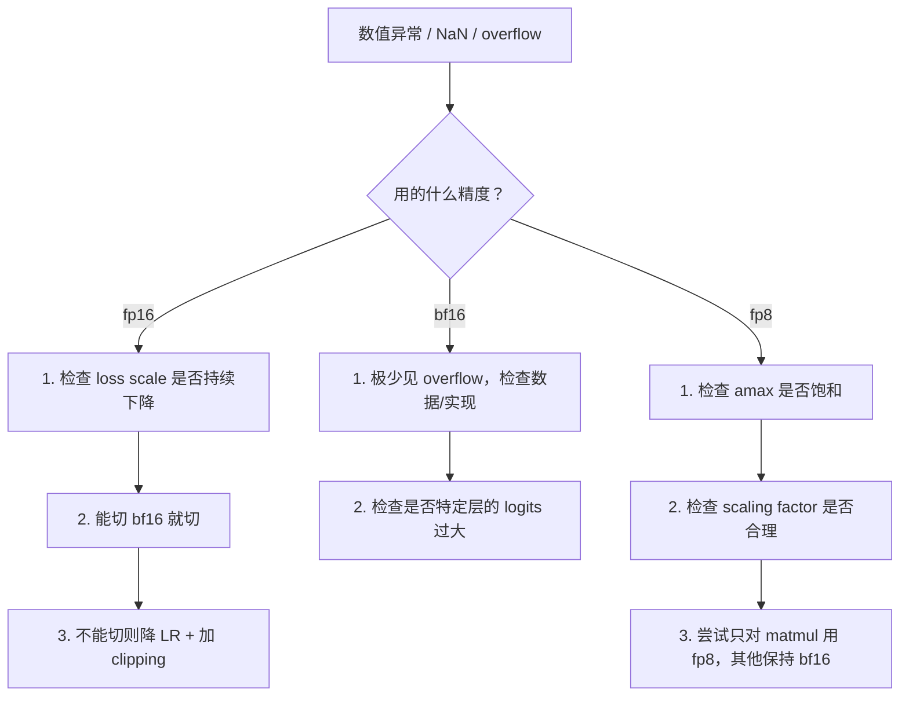

# 混合精度训练排障实战

本页面详细介绍 fp16 / bf16 / fp8 三种混合精度的原理、常见问题与排障方法。

---

## 三种精度对比

| 维度 | fp16 | bf16 | fp8 |
| --- | --- | --- | --- |
| **指数位** | 5 bit | 8 bit | 4-5 bit |
| **尾数位** | 10 bit | 7 bit | 2-3 bit |
| **动态范围** | ~6×10⁴ | ~3.4×10³⁸ | ~448（E4M3） |
| **Overflow 风险** | 🔴 高（需 GradScaler） | 🟢 极低 | 🟡 中（需 amax scaling） |
| **工程复杂度** | 中 | 低 | 高 |
| **硬件要求** | V100+ | A100+ / H100 | H100+ |

---

## fp16 + GradScaler 排障

### 原理

fp16 动态范围小，梯度容易 underflow。`GradScaler` 将 loss 放大再 backward，如果产生 overflow 则跳过该 step 并缩小 scale。

```python
import torch
from torch.cuda.amp import GradScaler, autocast

class FP16Diagnostics:
    """监控 fp16 训练的 loss scale 健康度。"""

    def __init__(self):
        self.scale_history = []
        self.overflow_count = 0
        self.total_steps = 0

    def check(self, scaler: GradScaler, step: int) -> list[str]:
        alerts = []
        self.total_steps += 1
        current_scale = scaler.get_scale()
        self.scale_history.append(current_scale)

        # 检查 scale 是否持续下降
        if len(self.scale_history) > 50:
            recent = self.scale_history[-10:]
            older = self.scale_history[-50:-40]
            if sum(recent) / len(recent) < sum(older) / len(older) * 0.1:
                alerts.append(
                    f"CRITICAL: loss scale 持续下降: "
                    f"{sum(older)/len(older):.0f} -> {sum(recent)/len(recent):.0f}"
                )

        # 检查 scale 是否太小
        if current_scale < 1.0:
            alerts.append(f"CRITICAL: loss scale={current_scale:.2f} < 1.0")

        # 检查 overflow 比例
        # GradScaler 会在 overflow 时跳过 step
        found_inf = scaler._check_inf_per_device(scaler._found_inf_per_device(
            scaler._per_optimizer_states
        )) if hasattr(scaler, '_check_inf_per_device') else False

        return alerts

    @property
    def overflow_ratio(self):
        return self.overflow_count / max(1, self.total_steps)
```

### 完整 fp16 训练循环

```python
def train_fp16(model, optimizer, dataloader):
    scaler = GradScaler()
    diagnostics = FP16Diagnostics()

    for step, batch in enumerate(dataloader):
        optimizer.zero_grad()

        with autocast(dtype=torch.float16):
            loss = model(**batch).loss

        scaler.scale(loss).backward()

        # 在 unscale 后裁剪
        scaler.unscale_(optimizer)
        grad_norm = torch.nn.utils.clip_grad_norm_(model.parameters(), 1.0)

        # step（如果 overflow 则自动跳过）
        scaler.step(optimizer)
        scaler.update()

        # 诊断
        alerts = diagnostics.check(scaler, step)
        if alerts:
            for a in alerts:
                print(f"🚨 {a}")
            print(f"  建议：切换到 bf16 或降低 LR")

        if step % 100 == 0:
            print(f"Step {step}: loss={loss.item():.4f} "
                  f"scale={scaler.get_scale():.0f} "
                  f"grad_norm={grad_norm:.4f}")
```

---

## bf16 训练（推荐）

bf16 动态范围与 fp32 相同，无需 GradScaler，大幅简化工程：

```python
def train_bf16(model, optimizer, dataloader):
    """推荐的 bf16 训练循环，无需 GradScaler。"""
    for step, batch in enumerate(dataloader):
        optimizer.zero_grad()

        with autocast(dtype=torch.bfloat16):
            loss = model(**batch).loss

        loss.backward()

        # 直接裁剪，无需 unscale
        grad_norm = torch.nn.utils.clip_grad_norm_(model.parameters(), 1.0)

        # 检查 nonfinite（极少见但仍需防护）
        if math.isnan(grad_norm) or math.isinf(grad_norm):
            print(f"⚠️ Step {step}: nonfinite grad, skipping")
            optimizer.zero_grad()
            continue

        optimizer.step()
```

---

## fp8 训练监控

fp8 动态范围极小（E4M3 最大 ~448），依赖 per-tensor amax scaling：

```python
class FP8Monitor:
    """监控 fp8 的 amax 和 scaling factor 健康度。"""

    def __init__(self, warn_amax_ratio=0.9):
        self.warn_amax_ratio = warn_amax_ratio  # amax/max_representable > ratio 则告警
        self.max_e4m3 = 448.0
        self.max_e5m2 = 57344.0

    def check_tensor(self, tensor: torch.Tensor, name: str, fmt="e4m3") -> list[str]:
        alerts = []
        max_val = self.max_e4m3 if fmt == "e4m3" else self.max_e5m2

        amax = tensor.abs().max().item()
        ratio = amax / max_val

        if ratio > self.warn_amax_ratio:
            alerts.append(
                f"FP8 SATURATION: {name} amax={amax:.2f}, "
                f"max_representable={max_val}, ratio={ratio:.2%}"
            )

        if amax < 1e-6:
            alerts.append(f"FP8 UNDERFLOW: {name} amax={amax:.2e} 近乎为零")

        return alerts

    def check_model(self, model, step) -> list[str]:
        all_alerts = []
        for name, param in model.named_parameters():
            if param.grad is not None:
                alerts = self.check_tensor(param.grad, f"grad:{name}")
                all_alerts.extend(alerts)
        if all_alerts:
            print(f"\n🚨 FP8 issues at step {step}:")
            for a in all_alerts:
                print(f"  {a}")
        return all_alerts
```

---

## 精度自动选择器

```python
def select_precision(hardware: str, model_size_b: float) -> dict:
    """
    根据硬件和模型规模推荐精度配置。

    Args:
        hardware: "V100" | "A100" | "H100" | "H200"
        model_size_b: 模型参数量（十亿）
    """
    configs = {
        "V100": {"dtype": "fp16", "use_scaler": True, "note": "仅支持 fp16"},
        "A100": {"dtype": "bf16", "use_scaler": False, "note": "推荐 bf16"},
        "H100": {"dtype": "bf16", "use_scaler": False,
                 "note": "推荐 bf16；FP8 可用于 matmul 加速"},
        "H200": {"dtype": "bf16", "use_scaler": False,
                 "note": "同 H100，显存更大"},
    }

    config = configs.get(hardware, configs["A100"])

    # 大模型在 H100 上可考虑 FP8 matmul
    if hardware in ("H100", "H200") and model_size_b >= 13:
        config["fp8_matmul"] = True
        config["note"] += "；建议开启 FP8 matmul 提升吞吐"

    print(f"推荐配置: {config}")
    return config
```

---

## 排障决策树

