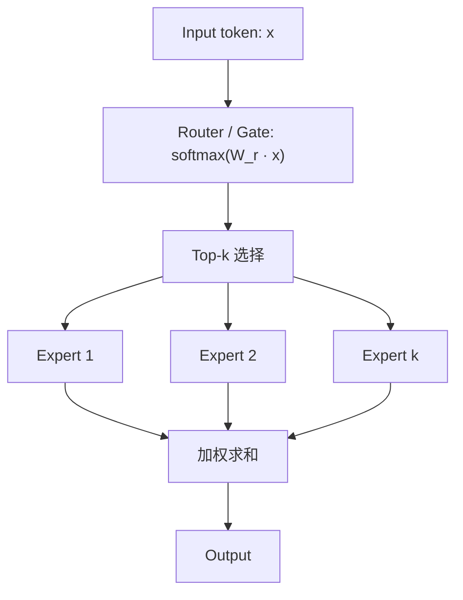

## 概述

Mixture of Experts (MoE) 将 MLP 层替换为多个并行 expert，每 token 仅激活 top-k 个，实现 **"总参数大但每 token 计算小"** 的目标。

---

## MoE 层结构



### 路由（Router）

$$g_i = \text{softmax}(W_r \cdot x)_i, \quad W_r \in \mathbb{R}^{E \times d}$$

选 top-k expert，加权输出：

$$y = \sum_{i \in \text{TopK}} g_i \cdot \text{Expert}_i(x)$$

---

## 参数量公式

### 每个 Expert

每个 expert 本质是一个独立 MLP（SwiGLU）：

$$N_{expert} = 3 \cdot d \cdot d_{ff}^{expert}$$

### 总参数

$$N_{total} = N_{shared} + E \times N_{expert}$$

- $N_{shared}$：所有 token 共享的参数（Attention + embedding + norm + router）

- $E$：expert 总数

### 每 token 激活参数

$$N_{active} = N_{shared} + k \times N_{expert}$$

- $k$：每 token 激活的 expert 数

---

## 典型模型实例

|模型|$E$|$k$|$N_{total}$|$N_{active}$|$N_{active}/N_{total}$|
|---|---|---|---|---|---|
|Mixtral-8x7B|8|2|46.7B|~12.9B|~28%|
|DeepSeek-V2|160|6|236B|~21B|~9%|
|DeepSeek-V3|256|8|671B|~37B|~5.5%|
|Qwen-2.5-MoE-A3B|60|4|14.3B|~2.7B|~19%|

> [!important]
> 
> **DeepSeek-V3 特殊性**：除了 256 个 routed expert 外还有 1 个 shared expert（每 token 必定激活），因此 $N_{active}$ = shared layers + shared expert + 8 routed experts。

---

## MoE 对不同指标的影响

|指标|主要看|MoE vs Dense 同 FLOPs|
|---|---|---|
|**单 token FLOPs**|$N_{active}$|相当|
|**模型质量**（同 FLOPs 预算）|$N_{total}$ 提供更多容量|MoE 通常更好|
|**权重存储 / checkpoint**|$N_{total}$|MoE 大很多|
|**显存（推理）**|$N_{total}$（所有 expert 需常驻）|MoE 大很多|
|**通信开销**|$E$, 路由策略|MoE 需 EP all-to-all|
|**推理延迟**|$N_{active}$ • 通信|取决于 EP 实现效率|

---

## Python 计算脚本

```Python
def count_moe_params(
    L: int,                # 层数
    d: int,                # 隐藏维
    d_ff_shared: int,      # 共享 MLP 中间维 (非 MoE 层)
    d_ff_expert: int,      # Expert MLP 中间维
    h: int,                # query head 数
    h_kv: int,             # KV head 数
    d_head: int,           # 每头维度
    V: int,                # 词表大小
    E: int,                # expert 总数
    k: int,                # top-k 激活
    n_moe_layers: int = None,  # MoE 层数 (默认=L)
    has_shared_expert: bool = False,  # 是否有 shared expert
) -> dict:
    n_moe_layers = n_moe_layers or L
    n_dense_layers = L - n_moe_layers

    # Attention per layer
    attn = d * (h * d_head) + 2 * d * (h_kv * d_head) + (h * d_head) * d

    # Dense MLP per layer
    mlp_dense = 3 * d * d_ff_shared

    # Expert MLP
    mlp_expert = 3 * d * d_ff_expert

    # Router per MoE layer
    router = E * d

    # Shared expert (if any)
    shared_expert = mlp_expert if has_shared_expert else 0

    # Per MoE layer
    moe_layer = attn + E * mlp_expert + router + shared_expert + 2 * d
    dense_layer = attn + mlp_dense + 2 * d

    # Total
    total = (
        n_moe_layers * moe_layer
        + n_dense_layers * dense_layer
        + V * d + d  # embed + final norm
    )

    # Active per token
    active_moe_layer = attn + k * mlp_expert + shared_expert + 2 * d
    active = (
        n_moe_layers * active_moe_layer
        + n_dense_layers * dense_layer
        + V * d + d
    )

    return {
        "N_total": f"{total / 1e9:.1f}B",
        "N_active": f"{active / 1e9:.1f}B",
        "ratio": f"{active / total * 100:.1f}%",
    }

# Mixtral-8x7B
print(count_moe_params(
    L=32, d=4096, d_ff_shared=14336, d_ff_expert=14336,
    h=32, h_kv=8, d_head=128, V=32000,
    E=8, k=2, n_moe_layers=32
))
# {'N_total': '46.7B', 'N_active': '12.9B', 'ratio': '27.6%'}
```

---

## 负载均衡与辅助损失

> [!important]
> 
> MoE 训练的核心挑战：如果路由不均衡，少数 expert 被过度激活（"expert collapse"），导致：
> 
> - 模型容量浪费
> 
> - EP 通信负载偏斜
> 
> - 训练不稳定

### 常见解决方案

1. **辅助均衡损失**：$L_{aux} = alpha cdot E cdot sum_i f_i cdot p_i$（鼓励均匀分配）

1. **Top-k + noise**：在 logits 上加噪声打破对称性

1. **Expert capacity**：限制每个 expert 处理的 token 数上限

1. **DeepSeek 的无辅助损失方案**：引入 bias term 自适应调节分配，避免 $L_{aux}$ 对主任务的干扰