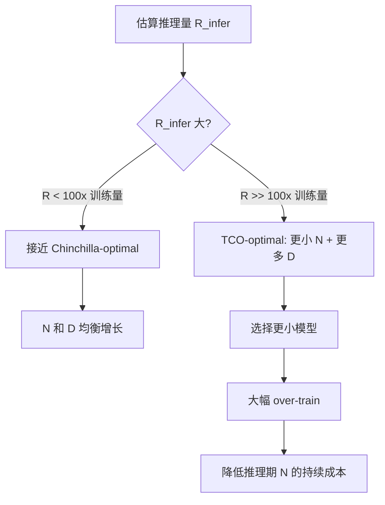

## 概述

Chinchilla 优化的是**纯训练 loss**，但现实中大模型部署后推理量远超训练量。当推理成本纳入考量，最优策略从 "compute-optimal" 转向 **"TCO-optimal"**。

---

## 核心洞察

> [!important]
> 
> **Chinchilla-optimal ≠ Deployment-optimal**
> 
> 推理每 token 成本 $propto N$，部署期总推理量 $R_{infer} \gg$ 训练量时，更大的 $N$ 意味着持续更高的运营成本。

---

## 总成本模型

$$TCO = C_{train} \cdot p_{train} + R_{infer} \cdot c_{infer}(N) \cdot p_{infer}$$

- $C_{train} = 6ND$：训练 FLOPs

- $p_{train}$：每 FLOP 训练成本

- $R_{infer}$：部署期总推理 token 数

- $c_{infer}(N) approx 2N$：每 token 推理 FLOPs

- $p_{infer}$：每 FLOP 推理成本

### 简化为

$$TCO \propto 6ND + \lambda \cdot 2N \cdot R_{infer}$$

其中 $lambda = p_{infer} / p_{train}$（推理/训练单位成本比）

---

## Over-training 策略

当 $R_{infer}$ 很大时，最优解偏向：

$$\boxed{N_{opt}^{TCO} < N_{opt}^{Chinchilla}, \quad D_{opt}^{TCO} > D_{opt}^{Chinchilla}}$$

即 **更小模型 + 更长训练**（over-training），以降低推理期 $N$ 带来的持续成本。

---

## 实际 Over-training 案例

|模型|$N$|$D$|$D/N$|Chinchilla 建议 $D$|Over-train 倍率|
|---|---|---|---|---|---|
|Chinchilla (理想)|70B|1.4T|20|1.4T|1x|
|LLaMA-1 7B|7B|1T|143|140B|~7x|
|LLaMA-2 7B|7B|2T|286|140B|~14x|
|LLaMA-3.1 8B|8B|15T|1875|160B|~94x|
|Mistral 7B|7B|~8T|~1143|140B|~57x|
|Qwen-2.5 7B|7.6B|18T|~2370|152B|~118x|

> [!important]
> 
> **趋势**：从 LLaMA-1 到 LLaMA-3.1，over-training 倍率从 7x 飙升到 94x。这反映了行业从 "训练最优" 到 "部署最优" 的根本转变。

---

## 数学推导：TCO-optimal 分配

```Python
import numpy as np
from scipy.optimize import minimize_scalar

def tco_optimal(C_budget, R_infer, alpha=0.34, beta=0.28, 
                A=406.4, B=410.7, L_inf=1.69, lam=1.0):
    """
    给定训练 FLOPs 预算 C_budget 和推理量 R_infer，
    求 TCO 最优的 N
    """
    def tco(log_N):
        N = 10**log_N
        D = C_budget / (6 * N)
        if D <= 0:
            return 1e20
        # 训练损失
        loss = L_inf + A / N**alpha + B / D**beta
        # TCO = 训练成本 + 推理成本（与 N 成正比）
        train_cost = C_budget
        infer_cost = lam * 2 * N * R_infer
        return train_cost + infer_cost
    
    result = minimize_scalar(tco, bounds=(7, 12), method='bounded')
    N_opt = 10**result.x
    D_opt = C_budget / (6 * N_opt)
    return N_opt, D_opt

# 对比不同推理量下的最优 N
C = 6 * 70e9 * 1.4e12  # Chinchilla 级预算
for R in [0, 1e12, 1e13, 1e14]:
    N, D = tco_optimal(C, R)
    print(f"R_infer={R:.0e}: N={N/1e9:.1f}B, D={D/1e12:.1f}T, D/N={D/N:.0f}")
```

---

## 实务决策框架



> [!important]
> 
> **决策要点**：
> 
> - 研究 / 能力探索 → 接近 Chinchilla-optimal
> 
> - 大规模商业部署 → TCO-optimal（更小模型 + 极致 over-training）
> 
> - 中间地带 → 用 TCO 公式估算，结合推理量 $R_{infer}$ 决定