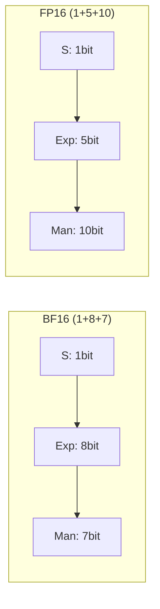

## 概述

理解浮点格式的关键在于 **位域分配**：指数位决定动态范围，尾数位决定精度。不同格式在这两者间做不同权衡。

---

## IEEE 754 浮点数表示

$$(-1)^s \times 2^{e - \text{bias}} \times (1 + m)$$

- $s$：符号位（1 bit）

- $e$：指数位（$n_e$ bits）

- $m$：尾数位（$n_m$ bits）

- bias = $2^{n_e - 1} - 1$

---

## 位域结构对比

|格式|总 bits|符号|指数 $n_e$|尾数 $n_m$|bias|最大正规数|最小正规数|精度（ULP @ 1.0）|
|---|---|---|---|---|---|---|---|---|
|**FP32**|32|1|8|23|127|$3.4 \times 10^{38}$|$1.2 \times 10^{-38}$|$1.19 \times 10^{-7}$|
|**BF16**|16|1|8|7|127|$3.4 \times 10^{38}$|$1.2 \times 10^{-38}$|$7.81 \times 10^{-3}$|
|**FP16**|16|1|5|10|15|$6.55 \times 10^{4}$|$6.1 \times 10^{-5}$|$9.77 \times 10^{-4}$|
|**FP8 E4M3**|8|1|4|3|7|448|$1.95 \times 10^{-3}$|$6.25 \times 10^{-2}$|
|**FP8 E5M2**|8|1|5|2|15|$5.73 \times 10^{4}$|$6.1 \times 10^{-5}$|$2.5 \times 10^{-1}$|

---

## BF16 vs FP16：为何 BF16 胜出



|维度|BF16|FP16|
|---|---|---|
|动态范围|$sim 10^{pm 38}$（与 FP32 相同）|$sim 10^{pm 4.5}$（极窄）|
|精度|较低（7 bit 尾数）|较高（10 bit 尾数）|
|训练稳定性|**好**：不易溢出/下溢|需要 loss scaling 防溢出|
|工程摩擦|低|需维护 loss scaler|

> [!important]
> 
> **BF16 胜出核心原因**：LLM 训练中梯度/激活的**动态范围**比**精度**更重要。FP16 的窄范围（max ~65504）容易在大模型训练中溢出，而 BF16 与 FP32 共享指数范围，几乎不需要额外数值策略。

---

## FP8 双格式策略

> [!important]
> 
> **E4M3**（权重 + 激活前向）和 **E5M2**（梯度）搭配使用，是 FP8 训练的标准配方。

- **E4M3**：精度更高（3 bit 尾数），适合权重和前向激活

- **E5M2**：范围更大（5 bit 指数），适合梯度（梯度分布更宽）

### Per-tensor scaling

FP8 需要 **scaling factor** 将数据范围映射到 FP8 可表示范围：

$$x_{fp8} = \text{clamp}(x / s, \text{fp8\_min}, \text{fp8\_max})$$

```Python
import torch

def fp8_quantize(tensor, fp8_max=448.0):
    """简化的 per-tensor FP8 E4M3 量化"""
    amax = tensor.abs().max()
    scale = fp8_max / amax.clamp(min=1e-12)
    # 量化
    quantized = (tensor * scale).clamp(-fp8_max, fp8_max)
    # 模拟 FP8 精度损失 (8 个离散值/象限)
    quantized = quantized.to(torch.float8_e4m3fn)
    # 反量化
    dequantized = quantized.float() / scale
    return dequantized, scale
```

---

## GPU Tensor Core 支持矩阵

|GPU|FP32|BF16|FP16|FP8|INT8|FP4|
|---|---|---|---|---|---|---|
|A100 (Ampere)|19.5 TF|312 TF|312 TF|❌|624 TOPS|❌|
|H100 (Hopper)|67 TF|990 TF|990 TF|**1979 TF**|1979 TOPS|❌|
|B200 (Blackwell)|~90 TF|~2250 TF|~2250 TF|**~4500 TF**|~4500 TOPS|**~9000 TF**|

> [!important]
> 
> 每一代 GPU 低精度算力翻倍增长，但**实际收益**取决于 kernel 成熟度和数值稳定性方案。FP8 在 H100 上已工程成熟，FP4 在 Blackwell 上仍处早期。