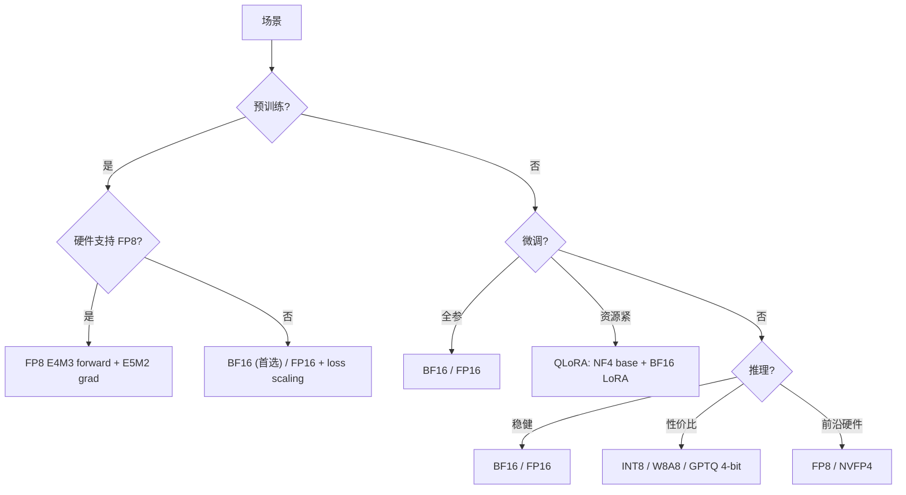

## 概述

精度/量化决定了每个参数、激活、梯度用多少 bit 表示。它直接影响 **存储体积、显存占用、计算吞吐、数值稳定性**，但 **低 bit ≠ 一定更快**。

---

## 4.1 四层精度对象

> [!important]
> 
> 讨论精度时必须分清"哪个对象的精度"——同一模型中可能同时存在 4 种不同精度。

|精度对象|含义|典型选择|
|---|---|---|
|**训练计算精度**|forward/backward GEMM 使用的 dtype|BF16 / FP16 / FP8|
|**主权重精度**|参数主副本的 dtype|FP32（master weight）/ BF16|
|**优化器状态精度**|$m, v$, master weights 的 dtype|FP32（标准）/ BF16（实验性）|
|**推理存储精度**|部署时 checkpoint / KV / 激活的 dtype|BF16 / FP8 / INT8 / 4-bit|

---

## 4.2 常见精度全景

|格式|bit 数|符号/尾数/指数|动态范围|工程定位|
|---|---|---|---|---|
|FP32|32|1/8/23|$\sim 10^{\pm 38}$|参考精度 / optimizer / debug / 累加保底|
|BF16|16|1/8/7|$\sim 10^{\pm 38}$|**当前最通用训练主力**；范围大，训练稳健|
|FP16|16|1/5/10|$\sim 10^{\pm 4.5}$|老牌半精度；精度更高但范围小，需 loss scaling|
|FP8 E4M3|8|1/4/3|$\sim 10^{\pm 4}$|前沿训练/推理；权重和激活的前向计算|
|FP8 E5M2|8|1/5/2|$\sim 10^{\pm 15}$|梯度存储（范围更大）|
|INT8|8|均匀量化|-128~127|成熟推理量化主力|
|NF4|4|正态分位|16 个固定值|QLoRA 微调侧经典|
|NVFP4|4|1/1/2 + 双层 scale|FP8 per-16 + FP32 全局|Blackwell 硬件原生；2025+ 前沿|
|MXFP4|4|1/1/2 + E8M0 scale|power-of-2 per-32 block|OCP 标准；多厂商互操作|

---

## 4.3 关键认知：低 bit ≠ 一定更快

> [!important]
> 
> 真实收益取决于：
> 
> - 硬件是否**原生支持**该精度的 Tensor Core / MAC
> 
> - kernel 是否**成熟**（fused GEMM、dequant-on-the-fly）
> 
> - 是否 **weight-only** 量化（激活仍为高精度 → 需要 mixed-precision GEMM）
> 
> - 激活 / KV cache 是否也降精度
> 
> - 当前瓶颈是 **compute-bound** 还是 **memory-bound**

---

## 4.5 精度选择决策树

---

## L3 子页面

- [[1 浮点格式全景：FP32 / BF16 / FP16 / FP8]] — 位域结构、范围精度对比、溢出/下溢分析

- [[2 后训练量化方案族：GPTQ / AWQ / SmoothQuant / [LLM.int](http://LLM.int)8]] — 原理、工程实践、质量对比

- [[3 训练时低精度：Mixed Precision 与 FP8 Training]] — AMP 流程、loss scaling、FP8 训练配方

- [[4 超低精度前沿：FP4 / NVFP4 / MXFP4]] — 2025+ 硬件原生超低精度路线

[[1 浮点格式全景：FP32 - BF16 - FP16 - FP8]]

[[2 后训练量化方案族：GPTQ - AWQ - SmoothQuant - LLM.int8]]

[[4 超低精度前沿：FP4 - NVFP4 - MXFP4]]

[[3 训练时低精度：Mixed Precision 与 FP8 Training]]