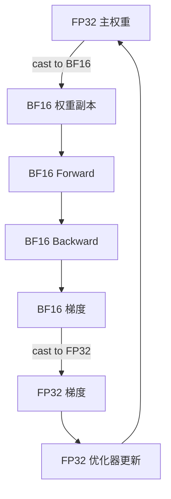

## 概述

混合精度训练（Mixed Precision Training）是当前 LLM 训练的标准范式，FP8 训练则是 2024+ 的前沿方向。

---

## Mixed Precision Training（AMP）

### 核心思路

- **前向 + 反向 GEMM**：使用低精度（BF16/FP16）→ 速度快

- **主权重**：保持 FP32 副本 → 梯度累积精度不丢失

- **累加器**：GEMM 内部使用 FP32 累加 → 防止精度退化



### PyTorch 实现

```Python
import torch
from torch.cuda.amp import autocast, GradScaler

model = MyLLM().cuda()
optimizer = torch.optim.AdamW(model.parameters(), lr=1e-4)
scaler = GradScaler()  # 仅 FP16 需要; BF16 通常不需要

for batch in dataloader:
    optimizer.zero_grad()
    
    with autocast(dtype=torch.bfloat16):  # BF16 自动混合精度
        loss = model(batch)
    
    # BF16: 直接 backward
    loss.backward()
    optimizer.step()
    
    # FP16 版本需要 GradScaler:
    # scaler.scale(loss).backward()
    # scaler.step(optimizer)
    # scaler.update()
```

> [!important]
> 
> **BF16 vs FP16 训练**：
> 
> - BF16 不需要 loss scaling → 工程更简单
> 
> - FP16 需要 GradScaler 防止梯度下溢 → 额外复杂度
> 
> - 当前主流 LLM 训练几乎全部使用 BF16

---

## Loss Scaling（FP16 专用）

### 为什么需要

FP16 最小正规数 $sim 6 times 10^{-5}$，很多梯度值小于此范围 → **梯度下溢为 0**。

### 方法

1. Loss 乘以 scale factor $s$（如 1024）

1. 反向传播得到放大后的梯度

1. 优化器更新前除以 $s$

$$\nabla_w (s \cdot L) = s \cdot \nabla_w L$$

**动态 loss scaling**：PyTorch 的 `GradScaler` 会自动调节 $s$：

- 无 overflow → 翻倍 $s$

- 检测到 inf/nan → 跳过更新，减半 $s$

---

## FP8 Training

### 架构

> [!important]
> 
> **FP8 训练标准配方**（H100/H800）：
> 
> - Forward GEMM：FP8 E4M3（权重 + 激活）
> 
> - Backward GEMM：FP8 E5M2（梯度）
> 
> - 主权重 + 优化器：FP32
> 
> - 累加器：FP32
> 
> - Per-tensor 或 per-block scaling

### Delayed Scaling

```Python
# 延迟缩放：使用上一步的 amax 来计算本步的 scale
# 避免每步都做 amax reduction（通信开销）

class FP8ScaleManager:
    def __init__(self, fp8_max=448.0, margin=0):
        self.fp8_max = fp8_max
        self.amax_history = []  # 滑动窗口
        self.margin = margin
    
    def compute_scale(self):
        if not self.amax_history:
            return 1.0
        amax = max(self.amax_history[-16:])  # 最近 16 步的最大值
        scale = self.fp8_max / (amax * (2 ** self.margin))
        return scale
    
    def update_amax(self, tensor):
        self.amax_history.append(tensor.abs().max().item())
```

### DeepSeek-V3 的 FP8 实践

> [!important]
> 
> DeepSeek-V3 在 2048×H800 集群上使用 FP8 训练：
> 
> - 所有 GEMM 使用 FP8（权重 + 激活均为 E4M3）
> 
> - **细粒度量化**：per-block（每 128 元素一个 scale）而非 per-tensor
> 
> - 累加器使用 FP32
> 
> - 结果：训练质量与 BF16 几乎无损，吞吐提升 ~40%

---

## 精度对比：训练质量与速度

|配置|训练质量|吞吐（相对 FP32）|显存（相对 FP32）|工程复杂度|
|---|---|---|---|---|
|FP32|基准|1x|1x|低|
|BF16 AMP|≈基准|2-3x|~0.6x|低|
|FP16 AMP|≈基准|2-3x|~0.6x|中（需 loss scaling）|
|FP8 (H100)|≈基准|3-5x|~0.5x|中-高|