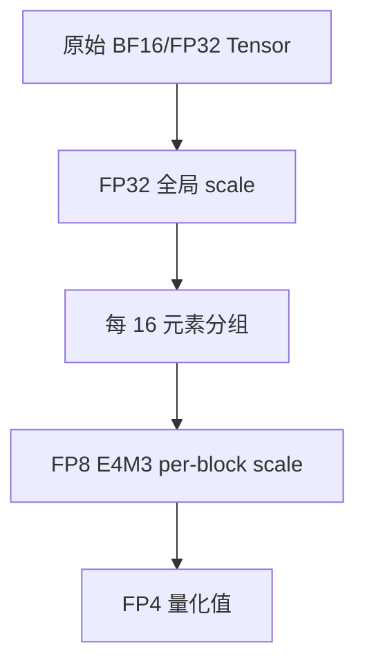

## 概述

4-bit 浮点是 2025+ 的硬件原生超低精度前沿。NVIDIA Blackwell 原生支持 NVFP4，OCP 标准定义了 MXFP4。两者都需要 **block scaling** 来弥补 4-bit 极有限的动态范围。

---

## FP4 基础：仅 16 个可表示值

4-bit 浮点（1 sign + 1 exponent + 2 mantissa）：

- 总共只有 $2^4 = 16$ 个不同值

- 动态范围极其有限

- **必须依赖 scaling factor** 扩展有效范围

---

## NVFP4：NVIDIA 双层缩放方案

### 架构

> [!important]
> 
> **NVFP4 双层缩放**（Blackwell 硬件原生）：
> 
> - **第一层**：每 16 个元素共享一个 **FP8 E4M3 scale**
> 
> - **第二层**：整个 tensor 共享一个 **FP32 全局 scale**



### 存储布局

$$\text{有效 bit/param} = 4 + \frac{8}{16} + \frac{32}{N_{tensor}} \approx 4.5 \text{ bits}$$

- 4 bits：量化值本身

- 0.5 bits：FP8 scale 开销（每 16 元素 8 bits → 0.5 bit/element）

- 全局 FP32 scale 开销可忽略

### 反量化公式

$$x_{dequant} = x_{fp4} \times s_{block}^{FP8} \times s_{global}^{FP32}$$

> [!important]
> 
> **双层缩放的好处**：粗粒度全局 scale 处理整体幅度，细粒度 block scale 适应局部分布差异，显著优于单层 scale 的质量。

---

## MXFP4：OCP 开放标准

### 架构

- **分组**：每 32 个元素共享一个 scale

- **Scale 格式**：E8M0（8-bit power-of-two，无尾数）

- **单层缩放**

$$s_{block} = 2^{e}, \quad e \in \{-127, ..., 127\}$$

### 存储布局

$$\text{有效 bit/param} = 4 + \frac{8}{32} = 4.25 \text{ bits}$$

---

## NVFP4 vs MXFP4 对比

|维度|**NVFP4**|**MXFP4**|
|---|---|---|
|Block 大小|16 元素|32 元素|
|Scale 格式|FP8 E4M3（有尾数）|E8M0（power-of-2，无尾数）|
|缩放层数|**双层**（block FP8 + global FP32）|**单层**（block E8M0）|
|有效 bits|~4.5|~4.25|
|量化质量|更高（细粒度 + 双层 + FP8 连续 scale）|较低（粗粒度 + 单层 + 离散 power-of-2）|
|硬件支持|NVIDIA Blackwell（B200）|OCP 标准，多厂商|
|互操作性|NVIDIA 专有|开放标准，跨厂商|
|Tensor Core 支持|Blackwell 第五代 TC|AMD / Intel / NVIDIA 均规划|

---

## 实际精度影响

> [!important]
> 
> **FP4 的局限性**：
> 
> - 仅 16 个可表示值 → 量化误差远大于 FP8/INT8
> 
> - **目前主要适用于 weight-only 量化推理**，不适合训练
> 
> - 质量高度依赖 calibration 和 scale 粒度
> 
> - kernel 和工具链仍在早期阶段（2025 年中）

### 精度保持策略

1. **更细的 block size**（NVFP4 的 16 优于 MXFP4 的 32）

1. **多层 scale**（NVFP4 双层优于 MXFP4 单层）

1. **敏感层保持高精度**：embedding、lm_head、attention QKV 可保持 FP8

1. **结合 calibration**：使用代表性数据集确定最优 scale

---

## Python 模拟

```Python
import torch
import numpy as np

def nvfp4_quantize(tensor, block_size=16):
    """
    模拟 NVFP4 双层缩放量化
    """
    # FP4 E1M2 可表示的正值: {0, 0.5, 1.0, 1.5, 2.0, 3.0, 4.0, 6.0}
    fp4_values = torch.tensor([0, 0.5, 1.0, 1.5, 2.0, 3.0, 4.0, 6.0])
    fp4_all = torch.cat([-fp4_values.flip(0)[:-1], fp4_values])  # 含负值
    
    flat = tensor.flatten()
    n = flat.numel()
    
    # 第二层：全局 FP32 scale
    global_amax = flat.abs().max()
    global_scale = global_amax / 6.0  # FP4 最大值为 6.0
    
    # 归一化
    normalized = flat / global_scale.clamp(min=1e-12)
    
    # 第一层：per-block FP8 scale
    padded = torch.nn.functional.pad(normalized, (0, block_size - n % block_size))
    blocks = padded.view(-1, block_size)
    block_amax = blocks.abs().max(dim=1, keepdim=True).values
    block_scale = block_amax / 6.0  # 映射到 FP4 范围
    
    # 量化到最近的 FP4 值
    scaled = blocks / block_scale.clamp(min=1e-12)
    quantized = fp4_all[torch.argmin((scaled.unsqueeze(-1) - fp4_all).abs(), dim=-1)]
    
    # 反量化
    dequantized = (quantized * block_scale * global_scale).flatten()[:n]
    
    mse = ((flat - dequantized) ** 2).mean().item()
    return dequantized.view_as(tensor), mse

# 测试
w = torch.randn(1024, 1024)
w_q, mse = nvfp4_quantize(w)
print(f"MSE: {mse:.6f}, relative error: {mse**0.5 / w.std().item():.4f}")
```