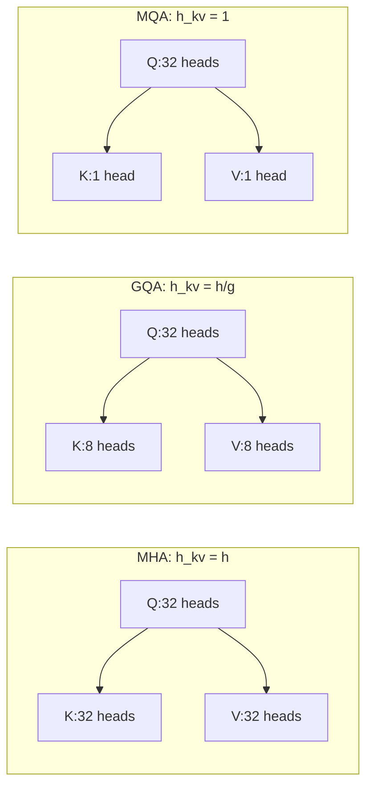
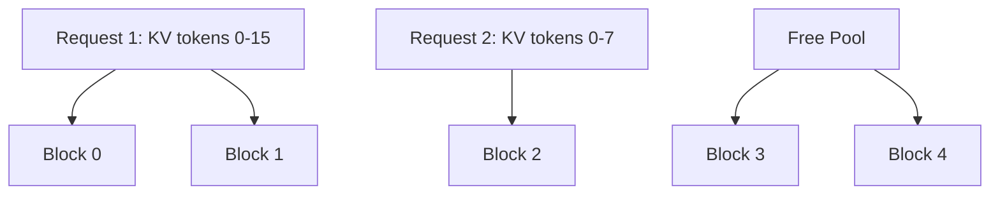

## 概述

推理时 KV cache 往往比权重更先炸显存。本页分析 KV cache 的核心杠杆与优化手段。

---

## KV Cache 公式回顾

$$M_{KV} = B \times T \times L \times 2 \times h_{kv} \times d_{head} \times \frac{b_{kv}}{8}$$

### 核心杠杆

|杠杆|方法|效果|
|---|---|---|
|$h_{kv}$ ↓|GQA / MQA|KV 直接按 $h_{kv}/h$ 缩小|
|$b_{kv}$ ↓|KV 量化（INT8 / FP8 / INT4）|2-4x 压缩|
|$T$ ↓|滑动窗口 / KV 稀疏 / 蒸馏|限制有效上下文长度|
|碎片 ↓|PagedAttention / vLLM|消除内存碎片，提高利用率|
|重复 ↓|Prefix caching / KV 共享|多请求共享相同 KV 前缀|

---

## GQA / MQA 降低 KV

### 从 MHA 到 GQA 到 MQA



|方案|$h_{kv}$|KV cache 相对 MHA|质量影响|代表模型|
|---|---|---|---|---|
|MHA|$h$|1x|基线|GPT-3, LLaMA-1|
|GQA|$h/g$|$1/g$|极小|LLaMA-2-70B (g=8)|
|MQA|$1$|$1/h$|略有|Falcon, PaLM-2|

---

## KV Cache 量化

将 KV cache 从 BF16 降至 INT8/FP8 甚至 INT4：

```Python
import torch

def kv_cache_size_gb(B, T, L, h_kv, d_head, b_kv=16):
    """计算 KV cache 大小 (GB)"""
    bytes_total = B * T * L * 2 * h_kv * d_head * (b_kv / 8)
    return bytes_total / 1e9

# LLaMA-2-70B, B=32, T=4096
for b_kv in [16, 8, 4]:
    size = kv_cache_size_gb(32, 4096, 80, 8, 128, b_kv)
    print(f"KV {b_kv}-bit: {size:.1f} GB")
# KV 16-bit: 42.9 GB
# KV 8-bit:  21.5 GB
# KV 4-bit:  10.7 GB
```

> [!important]
> 
> KV 量化可以 2-4x 降低 KV cache 显存，但需要注意量化对长序列注意力精度的影响。

---

## PagedAttention 虚拟内存

### 问题

传统 KV cache 为每个请求预分配 max_seq_len 的连续内存 → **大量浪费**（实际序列长度远小于 max）。

### 解决方案

借鉴操作系统虚拟内存：将 KV cache 分成固定大小的 **block**，按需分配：



### 关键收益

1. **零碎片**：按 block 分配，不浪费

1. **Copy-on-write**：fork 请求时共享 KV block

1. **Prefix sharing**：多请求共享系统 prompt 的 KV

1. **动态增长**：序列变长时追加 block 即可