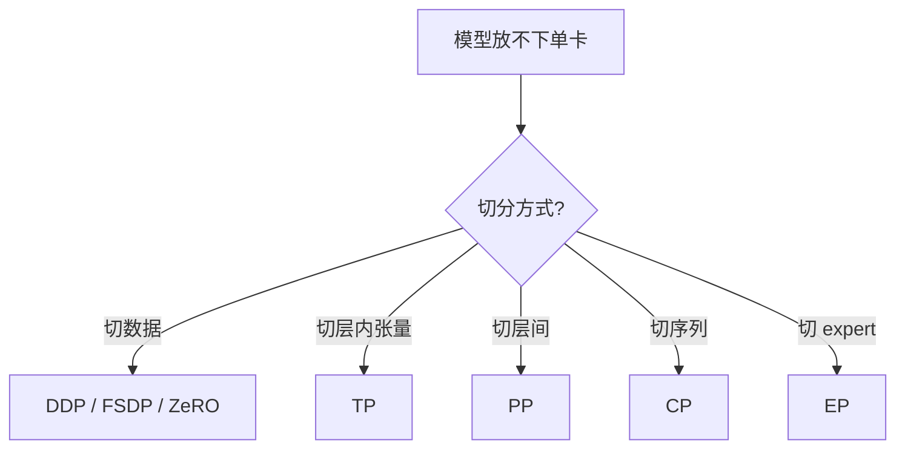
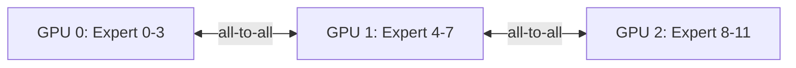

## 概述

当模型无法放入单卡时，需要多种并行策略的组合。本页系统介绍 6 种核心并行策略。

---

## 并行策略全景

---

## TP（Tensor Parallel）

### 原理

将单层的权重矩阵沿行或列切分到多卡，每卡计算部分结果，通过 all-reduce 合并。

### 切分方式

**列并行**（Column Parallel）：$Y = XA$，将 $A$ 按列切分

$$A = [A_1 | A_2], \quad Y_i = X \cdot A_i \quad \text{(各卡独立计算)}$$

**行并行**（Row Parallel）：$Y = XA$，将 $A$ 按行切分

$$A = \begin{bmatrix} A_1 \\ A_2 \end{bmatrix}, \quad Y = \sum_i X_i \cdot A_i \quad \text{(需 all-reduce)}$$

### 通信开销

每层 2 次 all-reduce（前向 + 反向各一次），通信量 $propto d times B times S$。

> [!important]
> 
> **TP 最佳实践**：TP 度数通常 ≤ 8（一个 NVLink 域内）。跨节点 TP 通信开销极大。

---

## PP（Pipeline Parallel）

### 原理

将模型按层划分为多个 stage，每个 stage 放在不同 GPU 上，通过流水线调度减少 bubble。

### Bubble 问题

$$\text{bubble ratio} = \frac{p - 1}{m} \quad (p = \text{PP stages}, m = \text{micro-batches})$$

### 调度策略

- **GPipe**：简单但 bubble 大

- **1F1B**：交错前向和反向，减少峰值显存

- **Interleaved 1F1B**：虚拟 stage 进一步降 bubble

- **Zero Bubble PP**：2024+ 前沿，接近零 bubble

---

## FSDP / ZeRO

### ZeRO 三个 Stage

|Stage|分片内容|显存节省|通信增加|
|---|---|---|---|
|Stage 1|优化器状态|~4x|无|
|Stage 2|优化器 + 梯度|~8x|无|
|Stage 3|优化器 + 梯度 + 权重|~$G$x|~1.5x|

### FSDP vs ZeRO

- **ZeRO**：DeepSpeed 实现，Stage 1/2/3

- **FSDP**：PyTorch 原生实现，类似 ZeRO Stage 3

- 两者原理相同，API 和生态不同

---

## CP（Context / Sequence Parallel）

### 问题

长序列训练时，单卡放不下完整序列的激活。

### 解决

将序列维度切分到多卡：

- **Ring Attention**：KV 在卡间环形传递

- **Ulysses**：attention QKV 分布式计算

> [!important]
> 
> **CP 使能长上下文**：128K+ 序列训练通常需要 CP + FlashAttention 配合。

---

## EP（Expert Parallel）

### 问题

MoE 模型的 expert 太多，无法全部放在单卡。

### 解决

将不同 expert 分布到不同 GPU：

- Router 决定 token 发往哪个 expert

- All-to-all 通信：token dispatch + combine

### 通信模式

> [!important]
> 
> **EP 挑战**：all-to-all 通信是 MoE 训练的主要瓶颈。DeepSeek 开源的 DeepEP 专门优化此通信。

---

## 组合策略示例

|模型|TP|PP|DP/FSDP|EP|CP|
|---|---|---|---|---|---|
|LLaMA-2-70B|8|4|FSDP|-|-|
|DeepSeek-V3|1|16|DP=2|64|-|
|长序列 7B|-|-|FSDP|-|4-8|