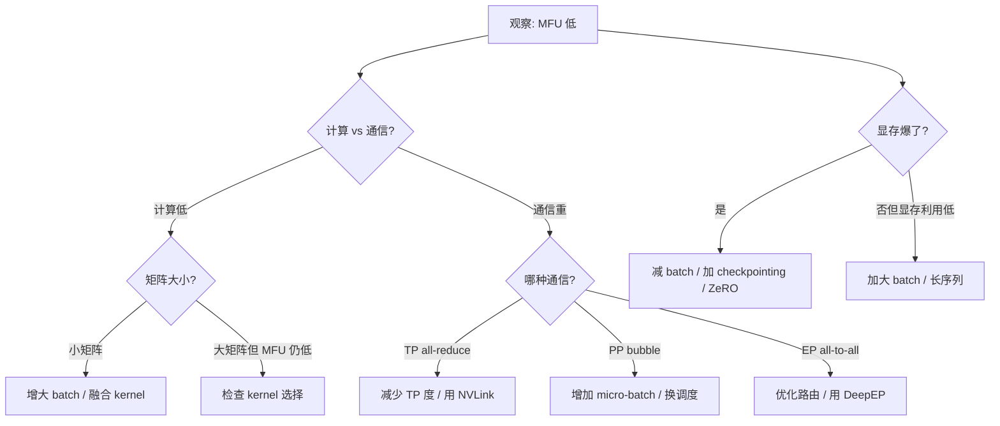

## 概述

训练 MFU 低下时，需要系统化定位瓶颈。本页提供诊断框架和常见问题解法。

---

## 诊断流程



---

## 常见瓶颈与解法

|瓶颈|现象|诊断方法|解法|
|---|---|---|---|
|**小矩阵**|Tensor Core 利用率低|nsight 看 GEMM 占比|加大 batch、融合 op|
|**TP 通信**|all-reduce 占比高|profiler 看通信时间占比|减少 TP 度、确保 NVLink|
|**PP bubble**|GPU 空闲时间多|计算 bubble ratio|增加 micro-batch、用 1F1B|
|**Activation checkpointing**|HFU 高但 MFU 低|比较 HFU vs MFU|减少 ckpt 层数、用选择性 ckpt|
|**数据加载**|GPU 等待数据|profiler 看 dataloader idle|增加 num_workers、预取、mmap|
|**Checkpoint I/O**|定期长时间暂停|监控 ckpt 写入时间|异步写入、分布式存储|
|**MoE 负载不均**|部分 GPU 忍等|监控每个 expert 的 token 量|均衡损失、capacity factor|
|**长序列 attention**|显存/时间急剧上升|序列长度 vs 单步时间曲线|FlashAttention + CP|

---

## Profiling 工具链

```Python
# PyTorch Profiler 基本用法
import torch
from torch.profiler import profile, ProfilerActivity, schedule

with profile(
    activities=[ProfilerActivity.CPU, ProfilerActivity.CUDA],
    schedule=schedule(wait=1, warmup=1, active=3, repeat=1),
    on_trace_ready=torch.profiler.tensorboard_trace_handler('./log'),
    record_shapes=True,
    profile_memory=True,
    with_stack=True,
) as prof:
    for step, batch in enumerate(dataloader):
        loss = model(batch)
        loss.backward()
        optimizer.step()
        prof.step()

# 查看结果
print(prof.key_averages().table(sort_by="cuda_time_total", row_limit=20))
```

### 关键指标检查清单

- [ ] **GEMM 占比**：应 >60%——否则 kernel 未融合或矩阵太小

- [ ] **通信占比**：应 <30%——否则 TP/PP/EP 配置不当

- [ ] **显存利用率**：应 >85%——否则可加大 batch

- [ ] **GPU idle**：应 <10%——否则数据流水线问题

- [ ] **HFU/MFU 差距**：差距大说明 checkpointing 重算多