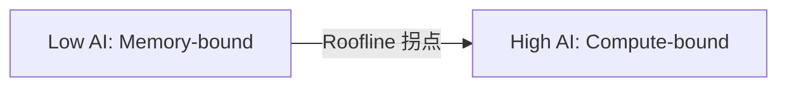

## 概述

推理优化的第一步是判断当前瓶颈是**算力受限**还是**带宽受限**，因为两者的优化方向完全不同。

---

## Roofline 模型

$$\text{Attainable FLOPs/s} = \min(F_{peak}, \text{AI} \times \text{BW})$$

- $text{AI}$：Arithmetic Intensity = FLOPs / Bytes

- 当 $text{AI} < F_{peak} / text{BW}$（拐点）→ memory-bound

- 当 $\text{AI} > F_{peak} / \text{BW}$ → compute-bound

### GPU 拐点参考

|GPU|BF16 TF|HBM BW (TB/s)|拐点 (FLOPs/Byte)|
|---|---|---|---|
|A100|312|2.0|156|
|H100|990|3.35|296|
|H800|~990|~3.0|~330|

---

## 推理场景分析

|场景|AI|瓶颈|优化方向|
|---|---|---|---|
|Prefill (S=1024)|~1024|Compute|TP、更快 kernel|
|Decode B=1|~1|Memory|量化权重、增大 batch|
|Decode B=32|~32|Memory → 过渡|Continuous batching|
|Decode B=256|~256|Compute|算力优化|
|长上下文 decode|低（KV 读取大）|KV-bandwidth|[[06_分组注意力|GQA]]、KV 量化|

> [!important]
> 
> **关键洞察**：增大 batch 可以将 decode 从 memory-bound 推向 compute-bound，这就是 **continuous batching** 提升吞吐的核心原理。

---

## 不同瓶颈的优化策略

### Memory-bound（带宽受限）

1. **权重量化**：减少每步读取的字节数

1. **KV 量化**：压缩 KV cache 带宽需求

1. **[[06_分组注意力GQA|GQA]]/[[05_多查询注意力MQA|MQA]]**：减少 KV head 数

1. **增大 batch**：提高 arithmetic intensity

1. **Speculative decoding**：用算力换带宽利用率

### Compute-bound（算力受限）

1. **更低精度计算**：FP8 GEMM

1. **TP 并行**：多卡分担算力

1. **更高效 kernel**：FlashAttention、融合 op

1. **更强 GPU**：升级硬件