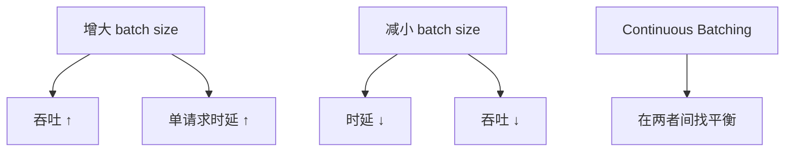
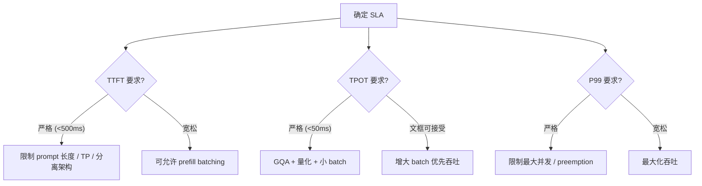

## 概述

生产推理系统必须同时优化吞吐和时延，但两者常常矛盾。本页分析其权衡关系。

---

## 核心指标

|指标|定义|用户感知|优化方向|
|---|---|---|---|
|**TTFT**|Time To First Token|用户等待首次响应|Prefill 加速|
|**TPOT**|Time Per Output Token|生成速度快慢|Decode 加速|
|**总吞吐**|tok/s (系统级)|-|Batching、算力利用率|
|**P95/P99 尾延**|第 95/99 百分位请求时延|SLA 合规|调度策略|

---

## 矛盾关系

### 为什么矛盾

1. **大 batch**：GPU 算力利用率高，但每个请求需等待其他请求完成

1. **小 batch**：单请求快，但 GPU 大量空闲

1. **长序列请求**：KV cache 占用大，挤压并发度

---

## Continuous Batching

> [!important]
> 
> **Continuous Batching** 不等待整个 batch 完成才处理下一个，而是当某个请求完成时立即插入新请求，保持 GPU 始终满载。

### 对比

|维度|Static Batching|Continuous Batching|
|---|---|---|
|调度|等所有请求完成再处理下一批|完成一个立即插入新的|
|GPU 利用率|低（有请求早结束但 GPU 空等）|高|
|吞吐|1x|2-4x|
|尾延|高（被最长请求拖累）|更均匀|

---

## Prefill-Decode 分离

> [!important]
> 
> 新趋势：将 prefill 和 decode 放在不同 GPU 上（Disaggregated Serving），避免 prefill 的 compute-bound 任务干扰 decode 的时延敏感性。

### 架构思路

- **Prefill 节点**：优化算力利用率，复用 batch

- **Decode 节点**：优化延迟，小 batch + 高带宽

- **KV 传输**：prefill 节点将 KV cache 发给 decode 节点

---

## 实务决策框架

