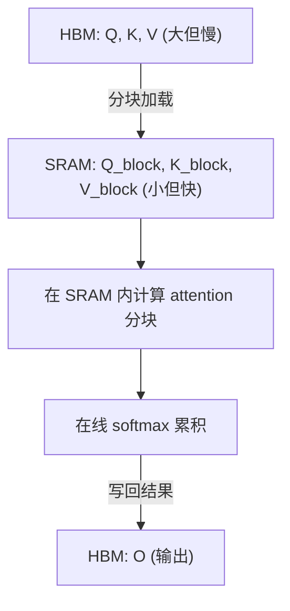

## 概述

FlashAttention 是 LLM 训练与推理的关键优化，核心思路是 **IO-aware tiling**——将 attention 计算分块，在 SRAM 上完成，避免大量 HBM 读写。

---

## 为什么需要 FlashAttention

### 标准 Attention 的问题

标准 attention：$O = text{softmax}(QK^T / sqrt{d}) cdot V$

需要**实化**整个 $S \times S$ 的 attention 矩阵：

- 显存：$O(B times h times S^2)$ → 长序列时爆炸

- HBM 读写：多次读写 $S \times S$ 矩阵

### FlashAttention 的解决

**不实化** $S \times S$ 矩阵，而是分块计算：

- 显存：$O(B times h times S)$（不存储完整 attention 矩阵）

- HBM 读写：减少 ~5-20x

---

## IO-Aware Tiling 原理



### 关键技术：Online Softmax

标准 softmax 需要先算所有 $QK^T$ 再取 max → 需要完整矩阵。

**Online softmax**（Milakov & Gimelshein, 2018）：

$$m_{new} = \max(m_{old}, m_{block})$$

$$l_{new} = l_{old} \cdot e^{m_{old} - m_{new}} + l_{block} \cdot e^{m_{block} - m_{new}}$$

$$o_{new} = o_{old} \cdot \frac{l_{old} \cdot e^{m_{old} - m_{new}}}{l_{new}} + \text{block\_result} \cdot \frac{l_{block} \cdot e^{m_{block} - m_{new}}}{l_{new}}$$

可以**逐块**计算 softmax，无需实化完整矩阵。

---

## FlashAttention 演进

|版本|年份|关键改进|硬件|
|---|---|---|---|
|**FA-1**|2022|IO-aware tiling + online softmax|A100|
|**FA-2**|2023|更好的 work partitioning + 减少非矩阵 FLOPs|A100/H100|
|**FA-3**|2024|Hopper 专用优化（wgmma + TMA + FP8 支持）|H100|
|**FlashMLA**|2025|DeepSeek MLA 架构专用 kernel|H800|

---

## 性能收益

|场景|标准 Attention|FlashAttention-2|加速比|
|---|---|---|---|
|S=2048, d=128|基准|2-3x|显存降 5-20x|
|S=8192|可能 OOM|可运行|核心使能|
|S=128K|不可能|需 + CP|必备|

---

## 使用方式

```Python
# PyTorch 内置 (推荐)
import torch.nn.functional as F

# 自动使用 FlashAttention (PyTorch 2.0+)
output = F.scaled_dot_product_attention(
    query, key, value,
    is_causal=True,  # decoder mask
    # PyTorch 会自动选择最优 backend (flash / mem_efficient / math)
)

# 或直接使用 flash-attn 库
from flash_attn import flash_attn_func
output = flash_attn_func(q, k, v, causal=True)
```