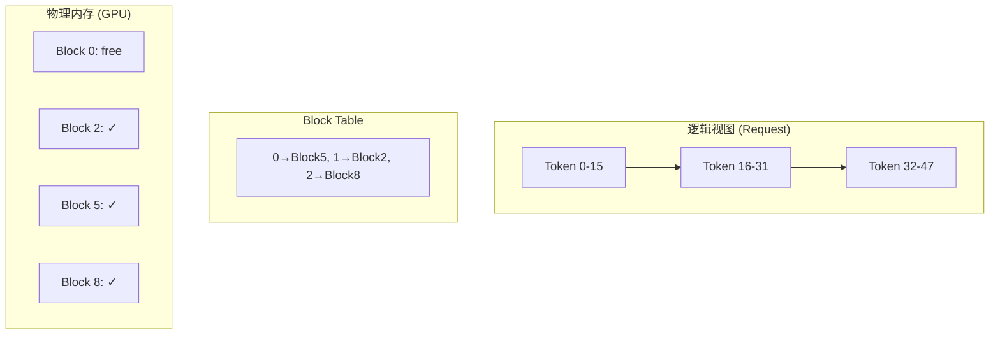
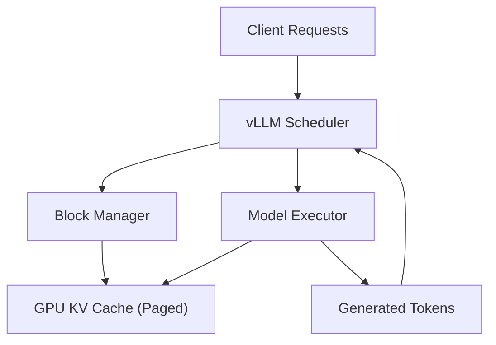

## 概述

PagedAttention 借鉴操作系统虚拟内存思想，解决 KV cache 的内存碎片和预分配浪费问题。vLLM 是其最著名的实现。

---

## 传统 KV Cache 的问题

### 预分配浪费

- 传统方案：为每个请求预分配 $\text{max\_seq\_len}$ 的连续内存

- 实际序列通常远短于 max → **内存利用率仅 ~20-40%**

### 碎片问题

- 请求长度不一 → 频繁分配/释放 → 外部碎片

- 无法利用碎片空间 → 有效容量下降

---

## PagedAttention 原理

### 核心思想

将 KV cache 分成固定大小的 **block**（如 16 tokens），按需分配，通过 **block table** 映射逻辑位置到物理位置。



### 关键机制

1. **按需分配**：新 token 生成时才分配 block

1. **非连续存储**：block 可以分散在物理内存任意位置

1. **Copy-on-write**：fork/beam search 时共享 block，修改时才复制

1. **Prefix sharing**：多请求的公共前缀只存一份

---

## vLLM 架构



### 核心组件

|组件|功能|
|---|---|
|**Scheduler**|Continuous batching + preemption 策略|
|**Block Manager**|管理 KV block 分配/释放/共享|
|**Model Executor**|模型推理（支持多种后端）|
|**PagedAttention Kernel**|支持非连续 KV 读取的 attention kernel|

---

## 性能收益

- **内存利用率**：从 ~20-40% 提升到 ~90%+

- **吞吐提升**：2-4x（因为能同时服务更多请求）

- **无质量损失**：纯工程优化，不影响模型输出

---

## 快速部署

```Python
# vLLM 快速启动
from vllm import LLM, SamplingParams

llm = LLM(
    model="meta-llama/Llama-2-7b-chat-hf",
    tensor_parallel_size=1,
    gpu_memory_utilization=0.9,
    max_model_len=4096,
)

sampling_params = SamplingParams(temperature=0.7, max_tokens=256)
outputs = llm.generate(["Hello, how are you?"], sampling_params)
print(outputs[0].outputs[0].text)

# 或启动 OpenAI 兼容 API 服务
# python -m vllm.entrypoints.openai.api_server \
#   --model meta-llama/Llama-2-7b-chat-hf \
#   --tensor-parallel-size 1
```

---

## SGLang：新一代推理框架

> [!important]
> 
> **SGLang**（2024-2025）在 vLLM 基础上进一步优化：
> 
> - **RadixAttention**：更高效的 prefix caching
> 
> - **更快的调度器**：Rust 重写
> 
> - **DeepSeek-R1 FP8 推理**：单节点 >1000 tok/s