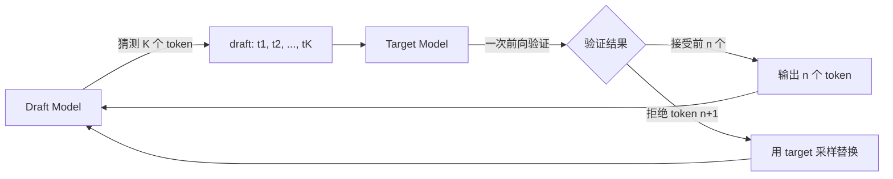

## 概述

Speculative Decoding 用小型 draft model 并行猜测多个 token，再用大型 target model 一次性验证，打破自回归 decode 的串行瓶颈。

---

## 核心问题

自回归 decode 本质上是**串行**的——每个 token 依赖前一个 token。单步 decode 是 memory-bound，GPU 算力大量浪费。

$$\text{串行步数} = \text{输出长度} \quad \Rightarrow \quad \text{延迟} \propto \text{输出长度}$$

---

## Draft-Verify 算法

### 算法步骤

1. **Draft 阶段**：小模型自回归生成 $K$ 个候选 token

1. **Verify 阶段**：大模型**一次前向**计算所有 $K$ 个位置的概率

1. **接受/拒绝**：逐个比较 draft 和 target 的分布，按接受概率决定

1. **结果**：平均接受 $\alpha K$ 个 token（$alpha$ 为接受率）

### 加速比

$$\text{speedup} \approx \frac{\alpha K + 1}{\text{draft\_time} \times K + \text{verify\_time}}$$

典型加速 2-3x（取决于 draft 模型质量和 $K$）。

---

## 数学保证：无损输出分布

> [!important]
> 
> **关键定理**：通过精心设计的接受-拒绝采样，speculative decoding 的输出分布与直接用 target model 采样**完全一致**。

### 接受概率

对于位置 $i$，draft 采样的 token $x$ 的接受概率：

$$P_{accept}(x) = \min\left(1, \frac{p_{target}(x)}{p_{draft}(x)}\right)$$

若拒绝，从修正分布中重新采样：

$$p_{resample}(x) = \frac{\max(0, p_{target}(x) - p_{draft}(x))}{\sum_{x'} \max(0, p_{target}(x') - p_{draft}(x'))}$$

这保证了最终采样分布 = $p_{target}$。

---

## 变体方案

|变体|Draft 来源|特点|
|---|---|---|
|标准 Speculative|独立小模型|需要额外模型|
|Self-Speculative|跳过部分层|不需要额外模型|
|Medusa|多头并行预测|需要额外训练|
|EAGLE|特征级预测|更高接受率|