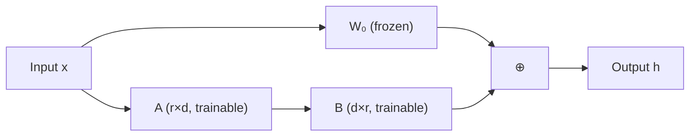

## 概述

LoRA（Low-Rank Adaptation）通过低秩分解大幅降低可训练参数量。QLoRA 进一步将基础模型量化至 4-bit，实现单卡微调大模型。

---

## LoRA 原理

### 核心思想

冻结预训练权重 $W_0$，训练低秩增量 $Delta W = BA$：

$$h = W_0 x + \Delta W x = W_0 x + B A x$$

- $W_0 in mathbb{R}^{d times d}$：冻结的预训练权重

- $A in mathbb{R}^{r times d}$：低秩矩阵（$r ll d$）

- $B in mathbb{R}^{d times r}$：低秩矩阵

- 可训练参数：$2 times r times d$（远小于 $d^2$）



### 参数效率

|$d$|$r$|原始参数|LoRA 参数|比例|
|---|---|---|---|---|
|4096|16|16.8M|131K|0.78%|
|4096|64|16.8M|524K|3.12%|
|8192|16|67.1M|262K|0.39%|

---

## QLoRA：4-bit 基础 + LoRA

### 三大技术创新

1. **NF4 量化**：基于正态分布的 4-bit 量化格式

1. **双重量化**：对 quantization scale 也做量化（节省 ~0.37 bit/param）

1. **分页优化器**：利用 CPU 内存处理长序列的峰值显存

### 显存对比

|方法|7B 模型显存|65B 模型显存|质量|
|---|---|---|---|
|全参 BF16|~112 GB|~1 TB+|最优|
|LoRA BF16|~16 GB|~140 GB|接近全参|
|**QLoRA**|**~6 GB**|**~41 GB**|接近全参|

> [!important]
> 
> **QLoRA 关键价值**：65B 模型微调从需要 8+ 张 A100 降至**单张 48GB GPU**（如 A6000）。

---

## 实战代码

```Python
from transformers import AutoModelForCausalLM, BitsAndBytesConfig
from peft import LoraConfig, get_peft_model, prepare_model_for_kbit_training
import torch

# QLoRA: 4-bit 量化加载
bnb_config = BitsAndBytesConfig(
    load_in_4bit=True,
    bnb_4bit_quant_type="nf4",        # NF4 量化
    bnb_4bit_use_double_quant=True,    # 双重量化
    bnb_4bit_compute_dtype=torch.bfloat16,
)

model = AutoModelForCausalLM.from_pretrained(
    "meta-llama/Llama-2-7b-hf",
    quantization_config=bnb_config,
    device_map="auto",
)
model = prepare_model_for_kbit_training(model)

# LoRA 配置
lora_config = LoraConfig(
    r=16,                    # 低秩维度
    lora_alpha=32,           # 缩放因子
    target_modules=["q_proj", "k_proj", "v_proj", "o_proj",
                    "gate_proj", "up_proj", "down_proj"],
    lora_dropout=0.05,
    bias="none",
    task_type="CAUSAL_LM",
)

model = get_peft_model(model, lora_config)
model.print_trainable_parameters()
# Output: trainable params: 13.6M || all params: 6.74B || 0.20%
```

---

## 部署合并

```Python
# 微调完成后合并权重
from peft import PeftModel

base_model = AutoModelForCausalLM.from_pretrained("meta-llama/Llama-2-7b-hf")
model = PeftModel.from_pretrained(base_model, "path/to/lora/adapter")

# 合并 LoRA 权重到基础模型
merged_model = model.merge_and_unload()
merged_model.save_pretrained("path/to/merged/model")
# 推理时与原始模型完全相同，无额外开销
```