## 概述

Continuous Batching 是高吞吐 LLM serving 的基础技术，将 GPU 利用率从 static batching 的 ~30% 提升到 ~80%+。

---

## Static vs Continuous Batching

### Static Batching

```mermaid
gantt
    title Static Batching
    dateFormat X
    axisFormat %s
    section Batch 1
    Req A (short)  :0, 3
    Req B (long)   :0, 8
    Req C (medium) :0, 5
    section Batch 2
    Req D          :8, 12
    Req E          :8, 11
```

- 问题：Req A 在第 3 步完成，但必须等 Req B 到第 8 步才能开始下一批

- **GPU 利用率**：$(3+8+5)/(3 times 8) = 67%$

### Continuous Batching

```mermaid
gantt
    title Continuous Batching
    dateFormat X
    axisFormat %s
    section GPU
    Req A (short)  :0, 3
    Req D (插入)  :3, 7
    Req B (long)   :0, 8
    Req C (medium) :0, 5
    Req E (插入)  :5, 9
```

- 当 Req A 完成时立即插入 Req D

- **GPU 始终满载**，利用率接近 100%

---

## 调度策略

### FCFS（First Come First Serve）

- 最简单，按到达顺序处理

- 问题：长请求占用资源久，影响短请求尾延

### Preemption（抢占）

当显存不足时，暂停某些请求的 KV cache：

1. **Swap**：将 KV cache 换出到 CPU 内存

1. **Recompute**：丢弃 KV cache，稍后重新计算

### Priority Scheduling

根据 SLA 要求给不同请求不同优先级。

---

## Iteration-level Batching

> [!important]
> 
> vLLM / SGLang 的核心调度单元是 **每次 decode iteration**，而非每个请求。每次 iteration 可以有不同的请求组合。

### 每次迭代的调度决策

1. 检查是否有新请求等待 prefill

1. 检查是否有请求完成可释放

1. 评估显存是否足够接纳新请求

1. 必要时 preempt 低优先级请求

1. 组装本次迭代的 batch

---

## Chunked Prefill

> [!important]
> 
> 将长 prompt 的 prefill 拆成多个 chunk，与 decode 交错执行，避免长 prefill 堵塞 decode 任务：
> 
> - 每个 chunk 处理 prefill 的一部分
> 
> - decode 请求不会被长 prefill 堵塞
> 
> - TPOT 更稳定