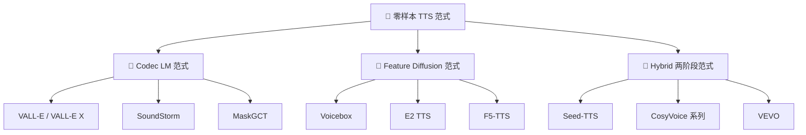

> [!important]
> 
> **一句话定位**：Codec LM / Feature Diffusion / Hybrid 三大范式梳理，CosyVoice 属于 Hybrid 路线的定位。

---

## 零样本 TTS 问题定义

零样本（Zero-shot）TTS 的目标：给定一段短参考音频（通常 3–10s），合成任意文本内容的语音，保持与参考音频一致的音色、韵律风格。

$$\hat{y} = f_{\text{TTS}}(\text{text}, \text{prompt}_{\text{speech}}) \quad \text{s.t.} \quad \text{spk}(\hat{y}) \approx \text{spk}(\text{prompt})$$

### 核心挑战

- **内容一致性**：合成语音必须与输入文本完全一致（低 CER/WER）

- **说话人相似度**：音色必须与 prompt 高度一致（高 SIM）

- **韵律自然度**：语调、停顿、情感必须自然（高 MOS）

- **泛化能力**：对未见过的说话人仍能高质量合成

## 三大范式分类

### 范式一：Codec Language Model

**核心思想**：将语音编码为多层离散 codec token（如 Encodec / SoundStream 的 RVQ），用自回归语言模型逐 token 生成。

$$p(\mathbf{c} | \text{text}, \text{prompt}) = \prod_{t=1}^{T} \prod_{q=1}^{Q} p(c_{t,q} | c_{<t}, \text{text}, \text{prompt})$$

- **优势**：利用 LLM 强大的序列建模能力，零样本泛化好

- **局限**：codec token 缺乏显式语义信息；多层 RVQ 增加建模复杂度；自回归推理慢

- **代表**：VALL-E、VALL-E X、SoundStorm

### 范式二：Feature Diffusion / Flow Matching

**核心思想**：直接在连续特征空间（Mel / 潜在特征）上进行非自回归扩散/流匹配生成，无需离散化。

$$dx_t = v_\theta(x_t, t, \text{cond}) \, dt \quad \text{(Flow Matching ODE)}$$

- **优势**：保留连续特征细节；并行生成速度快

- **局限**：缺乏粗粒度语义控制；韵律建模弱于 LM

- **代表**：Voicebox、E2 TTS、F5-TTS

### 范式三：Hybrid 两阶段（CosyVoice 所属）

**核心思想**：结合前两者优势——粗粒度语义 LM + 细粒度声学生成模型协同工作。

- **优势**：语义建模与声学生成解耦，各自可独立优化；兼顾韵律控制与音质

- **局限**：两阶段级联可能累积误差；流式化设计更复杂

- **代表**：Seed-TTS、CosyVoice 系列、VEVO

## 三大范式对比

|**维度**|**Codec LM**|**Feature Diffusion**|**Hybrid (✅ CosyVoice)**|
|---|---|---|---|
|**表示空间**|离散 codec token (RVQ 多层)|连续特征 (Mel / 潜在)|离散语义 token + 连续 Mel|
|**生成方式**|自回归 (AR/NAR)|非自回归 (Diffusion/FM)|AR LM + FM|
|**韵律控制**|✅ 强 (序列建模)|⚠️ 弱|✅ 强 (LM 负责)|
|**音质细节**|⚠️ 受限于 codec 重建质量|✅ 强 (连续空间)|✅ 强 (FM 负责)|
|**流式支持**|✅ 天然支持 (AR)|❌ 困难|✅ 可设计 (v2+)|
|**语义对齐**|❌ 无监督 token|⚠️ 依赖外部对齐|✅ 监督语义 token|

> [!important]
> 
> **CosyVoice 的定位选择**：Hybrid 路线兼顾了 LM 的序列建模能力（韵律控制）和 FM 的连续生成能力（音质细节），同时通过 **监督语义 token** 解决了 Codec LM 范式中无监督 token 语义信息不足的问题。

---

### 子页面导航

[[1.1 Codec Language Model 范式（VALL-E 系列）]]

[[1.2 Feature Diffusion - Flow Matching 范式（Voicebox - F5-TTS）]]

[[1.3 Hybrid 两阶段范式（CosyVoice - Seed-TTS）]]