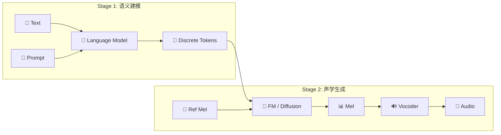

> [!important]
> 
> **一句话定位**：粗粒度语义 LM + 细粒度声学生成的协同设计，CosyVoice 与 Seed-TTS 的核心范式。

---

## Hybrid 范式核心思想

将 TTS 拆分为两个独立但协同的阶段，各自发挥最优性能：

### 设计哲学

$$\underbrace{\text{LM}}_{\text{韵律 + 内容}} \xrightarrow{\text{Discrete Tokens}} \underbrace{\text{FM/Diffusion}}_{\text{音质 + 细节}} \xrightarrow{\text{Mel}} \underbrace{\text{Vocoder}}_{\text{波形重建}}$$

## CosyVoice vs Seed-TTS

|**维度**|**CosyVoice**|**Seed-TTS**|
|---|---|---|
|**Token 来源**|监督语义 token (ASR 编码器)|自监督 token|
|**Stage 1**|AR LM (文本 → 语义 token)|AR LM (文本 → token)|
|**Stage 2**|Conditional Flow Matching|Diffusion Model|
|**流式**|✅ (v2+)|❌|
|**开源**|✅|❌|
|**后训练**|DPO / DiffRO|RL (PPO 等)|

## Hybrid 范式的优势

1. **解耦优化**：语义建模和声学生成可独立优化，互不干扰

1. **韵律控制**：LM 的序列建模天然适合韵律、停顿等高层特征

1. **音质保证**：FM/Diffusion 在连续空间生成高质量 Mel

1. **灵活扩展**：可独立升级 LM（更大模型）或 FM（更好架构）

## Hybrid 范式的挑战

- **级联误差**：Stage 1 的错误会传播到 Stage 2

- **流式设计复杂**：两阶段都需要支持流式，延迟叠加

- **Token 设计关键**：token 质量直接决定两阶段的信息传递效率

> [!important]
> 
> CosyVoice 通过 **监督语义 token** 解决了 token 质量问题，通过 **统一流式框架** 解决了流式设计问题，通过 **DiffRO** 解决了级联误差问题。