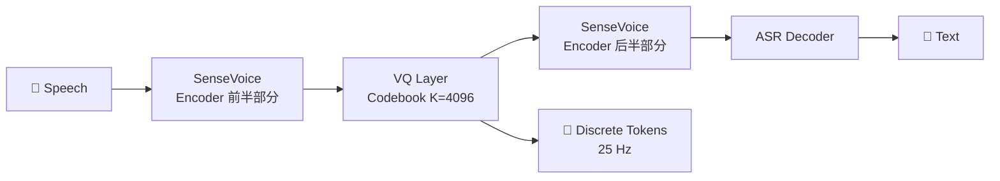

> [!important]
> 
> **一句话定位**：首次将向量量化插入 ASR 编码器中间层，codebook 4096，25Hz token rate。

---

## 架构设计

### SenseVoice Encoder

SenseVoice 是阿里通义的多语言语音识别模型，CosyVoice v1 将其编码器作为 tokenizer 的基座：

- 输入：Fbank 特征（25ms 窗口，10ms 帧移）

- 编码器：Conformer 架构，多层 self-attention + conv

- VQ 插入位置：编码器中间层（第 12 层附近）

- 输出帧率：经过 4× 下采样后为 25Hz

### VQ 训练目标

$$\mathcal{L}_{\text{total}} = \underbrace{\mathcal{L}_{\text{ASR}}}_{语音识别损失} + \underbrace{\alpha \cdot \| \text{sg}[z] - e \|^2}_{编码器损失} + \underbrace{\beta \cdot \| z - \text{sg}[e] \|^2}_{承诺损失}$$

其中 $z$ 是编码器输出，$e$ 是最近邻 codebook 向量，$text{sg}[cdot]$ 表示梯度截断。

## 关键参数

|**参数**|**值**|
|---|---|
|Codebook 大小 K|4096|
|Token 维度 d|512|
|Token Rate|25 Hz|
|Codebook 利用率|~23% (仅 ~940 个码本被使用)|
|EMA 更新|✅ 指数移动平均更新 codebook|

## v1 Tokenizer 的局限

> [!important]
> 
> **Codebook Collapse**：4096 个码本中只有 ~23% 被实际使用，大量码本“死亡”，降低了表示能力。这是 v2 引入 FSQ 的直接原因。

---

### 子页面导航

[[2.1.1 向量量化（Vector Quantization）原理]]

[[2.1.2 监督语义 Token 与无监督 Token（HuBERT - Encodec）对比]]