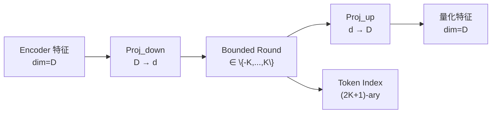

> [!important]
> 
> **一句话定位**：用有限标量量化替代 VQ，codebook 利用率从 23% 提升到 100%。

---

## FSQ 核心原理

与 VQ 使用 codebook 查找不同，FSQ 通过 **低秩投影 + 有界负整化** 实现量化：

$$\bar{H} = \text{Round}\left(\text{Proj}_{\text{down}}(H)\right), \quad \hat{H} = \text{Proj}_{\text{up}}(\bar{H})$$

### FSQ 步骤

### Codebook 大小计算

每个维度 $d_i$ 可取 $2K_i + 1$ 个离散值，总 codebook 大小：

$$|\mathcal{C}| = \prod_{i=1}^{d} (2K_i + 1)$$

例如 $d=4, K=4$，则 $|\mathcal{C}| = 9^4 = 6561$

## FSQ vs VQ 关键对比

|**维度**|**VQ (v1)**|**FSQ (v2)**|
|---|---|---|
|**量化方式**|最近邻 codebook 查找|标量取整 (round)|
|**可学习参数**|Codebook 向量 (EMA 更新)|Proj_down + Proj_up (梯度反传)|
|**Codebook 利用率**|~23%|**100%**|
|**Codebook Collapse**|✅ 存在|❌ 不存在|
|**梯度估计**|Straight-Through Estimator|Straight-Through Estimator|
|**ASR CER (test-zh)**|2.24%|**1.45%**|

## 编码器升级：SenseVoice-Large

v2 同时将编码器从 SenseVoice 升级到 SenseVoice-Large：

- 更大的 Conformer 编码器（更多层、更大隐藏维度）

- 更强的多语言 ASR 能力

- 更好的语义表征质量

> [!important]
> 
> **核心收益**：FSQ 完全消除了 codebook collapse 问题，所有码本都被充分利用，结合 SenseVoice-Large 更强的编码能力，v2 的 CER 相比 v1 降低 35%。

---

### 子页面导航

[[2.2.1 有限标量量化（Finite Scalar Quantization, FSQ）原理]]

[[2.2.2 FSQ vs VQ 实验对比与 t-SNE 可视化分析]]