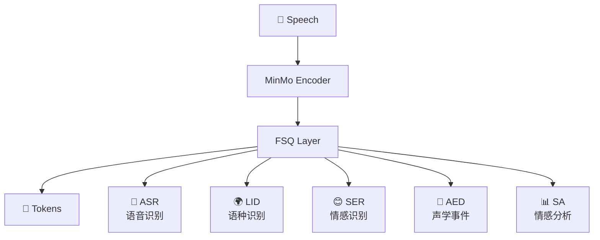

> [!important]
> 
> **一句话定位**：基于 MinMo 多模态 LLM，联合 ASR/LID/SER/AED/SA 五任务监督训练。

---

## 为什么需要多任务监督？

v1/v2 的 Tokenizer 仅用 ASR 监督，导致 token 主要编码语言内容，而 **副语言信息**（情感、口音、声学事件）捕获不足。v3 通过多任务监督解决这个问题。

## MinMo 基座模型

MinMo 是阿里的多模态语音理解大模型：

- **训练数据**：1.4M 小时多语言语音

- **能力**：ASR、语种识别、情感识别、声学事件检测、情感分析等

- 多个任务 SOTA

## 五任务监督训练

$$\mathcal{L}_{\text{total}} = \lambda_1 \mathcal{L}_{\text{ASR}} + \lambda_2 \mathcal{L}_{\text{LID}} + \lambda_3 \mathcal{L}_{\text{SER}} + \lambda_4 \mathcal{L}_{\text{AED}} + \lambda_5 \mathcal{L}_{\text{SA}}$$

|**任务**|**全称**|**作用**|
|---|---|---|
|ASR|Automatic Speech Recognition|保证语义内容编码|
|LID|Language Identification|捕获语言/方言信息|
|SER|Speech Emotion Recognition|捕获情感特征|
|AED|Audio Event Detection|捕获笑声、呼吸等声学事件|
|SA|Sentiment Analysis|捕获情感倾向|

## 多任务监督的收益

> [!important]
> 
> 多任务监督使 token 同时编码了语义内容和副语言信息，为下游 TTS 的情感控制、方言合成、副语言事件生成提供了更丰富的条件信息。

---

### 子页面导航

[[2.3.1 MinMo 语音理解大模型简介]]

[[2.3.2 多任务监督训练的收益与消融分析]]