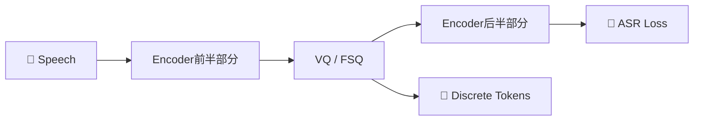
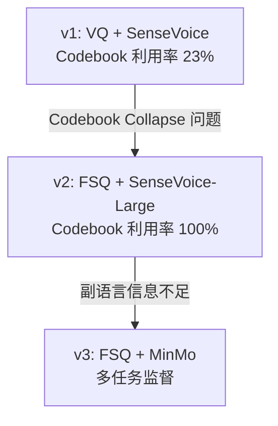

> [!important]
> 
> **一句话定位**：CosyVoice 最核心的创新——用 ASR 监督信号训练离散 token，从 VQ 到 FSQ 到多任务 FSQ-MinMo 的演进。

---

## 为什么需要监督语义 Token？

传统无监督 token（HuBERT / Encodec）存在两个核心问题：

1. **语义信息不足**：无监督 token 缺乏显式的文本对齐，导致内容一致性差

1. **说话人信息泄漏**：codec token 编码了音色信息，影响零样本转换

CosyVoice 的解决方案：将 **向量量化层插入 ASR 编码器中间层**，用语音识别损失监督训练：

关键洞察：量化层作为 **信息瓶颈**，迫使编码器丢弃说话人信息、保留语义信息：

$$\mathcal{L} = \mathcal{L}_{\text{ASR}}(\text{Decoder}(\text{Quantize}(\text{Encoder}_{\text{front}}(x))), y_{\text{text}})$$

## 三代 Tokenizer 演进

|**维度**|**v1: VQ**|**v2: FSQ**|**v3: FSQ-MinMo**|
|---|---|---|---|
|**量化方法**|向量量化 (VQ)|有限标量量化 (FSQ)|FSQ (同 v2)|
|**编码器**|SenseVoice Encoder|SenseVoice-Large|MinMo 多模态 LLM|
|**Codebook 大小**|4096|$(2K+1)^d$|$(2K+1)^d$|
|**Codebook 利用率**|~23%|**100%**|**100%**|
|**Token Rate**|25 Hz|25 Hz|25 Hz|
|**监督信号**|ASR|ASR|ASR + LID + SER + AED + SA|
|**关键改进**|首次提出监督语义 token|消除 codebook collapse|多任务监督捕获副语言信息|

### 演进逻辑

---

### 子页面导航

[[2.1 CosyVoice v1：VQ + SenseVoice Encoder]]

[[2.2 CosyVoice v2：FSQ + SenseVoice-Large]]

[[2.3 CosyVoice v3：多任务 FSQ-MinMo Tokenizer]]