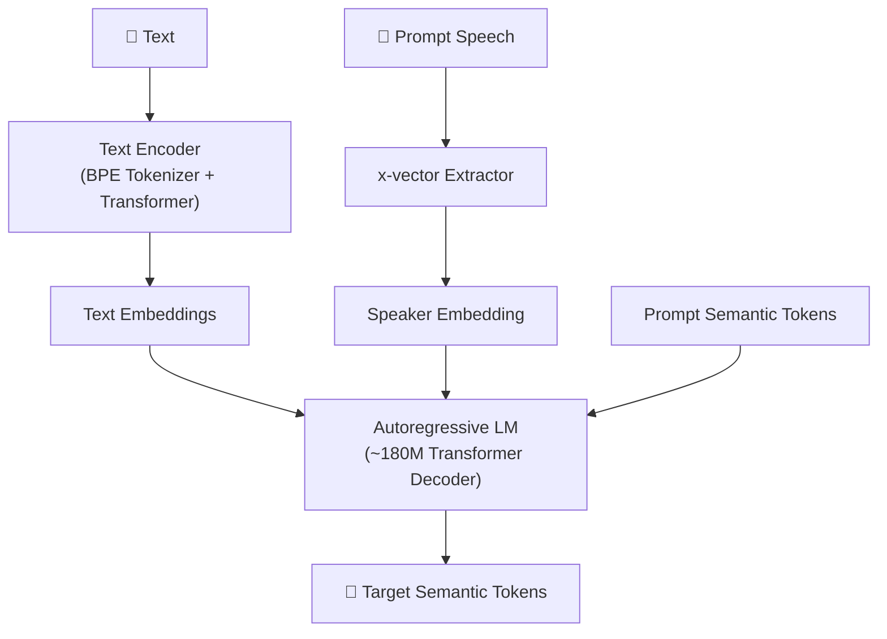

> [!important]
> 
> **一句话定位**：文本编码器对齐语义空间、说话人嵌入注入、teacher-forcing 训练。

---

## v1 LM 架构

### 输入序列结构

$$[S, \mathbf{v}, \text{text\_tokens}, T, \text{speech\_tokens}, E]$$

- $S$: 序列开始标记

- $mathbf{v}$: x-vector 说话人嵌入

- $text{text_tokens}$: Text Encoder 编码的文本

- $T$: 文本-语音分隔符

- $text{speech_tokens}$: 目标语义 token 序列

- $E$: 序列结束标记

### In-Context Learning 机制

零样本合成时，prompt 语音的 token 作为前缀注入：

$$[S, \mathbf{v}, \text{text}_{\text{prompt}}, T, \text{speech}_{\text{prompt}}, \text{text}_{\text{target}}, T, \underbrace{\text{speech}_{\text{target}}}_{\text{AR 生成}}, E]$$

LM 通过 attention 机制“看到” prompt 的音色特征，实现零样本克隆。

## 训练策略

- **Teacher Forcing**：训练时使用 ground truth token 作为上下文

- **损失函数**：交叉熵损失

$$\mathcal{L}_{\text{LM}} = -\sum_{t=1}^{T} \log p_\theta(s_t | s_{<t}, \text{text}, \mathbf{v})$$

## v1 的局限

1. **信息泄漏**：x-vector 直接注入音色信息，可能干扰 token 生成的韵律自然度

1. **Text Encoder 冗余**：独立训练的 TE 与 LM 可能存在表征失配

1. **不支持流式**：AR 生成完整序列后才能传给 FM

---

### 子页面导航

[[3.1.1 序列构造与 In-Context Learning 机制]]