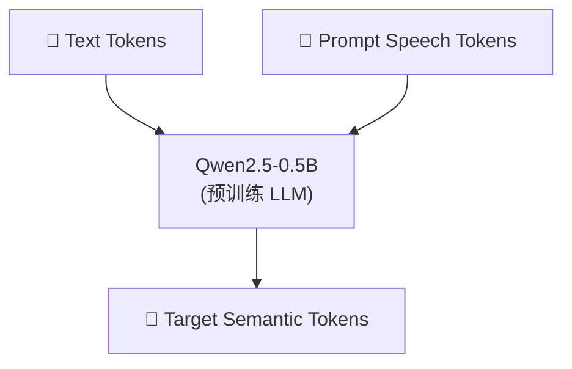

> [!important]
> 
> **一句话定位**：移除 Text Encoder 和 Speaker Embedding，直接用预训练 LLM，简化架构。

---

## v2 LM 架构

### v1 → v2 的三大简化

1. **移除 Text Encoder**：预训练 LLM 内置文本理解能力

1. **移除 Speaker Embedding**：避免 x-vector 的信息泄漏，用 prompt token 传递音色

1. **复用预训练权重**：利用 Qwen2.5-0.5B 的语言建模能力

## N:M Token 交错机制

统一流式/非流式的核心设计：每 N 个文本 token 对应 M 个语音 token，交替生成：

$$\text{Sequence} = [t_1, \ldots, t_N, s_1, \ldots, s_M, t_{N+1}, \ldots, t_{2N}, s_{M+1}, \ldots, s_{2M}, \ldots]$$

### 四种推理场景

|**场景**|**文本**|**语音**|**用途**|
|---|---|---|---|
|非流式|全部输入|全部生成|离线 TTS|
|语音流式|全部输入|流式输出|文本已知的 TTS|
|双向流式|流式输入|流式输出|LLM 对话场景|
|文本流式|流式输入|全部生成|实时字幕|

### Filling Token 机制

当文本还未全部到达时，用 filling token 填充文本位置，维持 N:M 交错结构的一致性。

## 为什么选择 Qwen2.5-0.5B？

- **预训练知识**：内置丰富的语言理解能力（多语种、上下文理解）

- **参数规模**：0.5B 在质量和推理速度间取得平衡

- **实验验证**：相比随机初始化，LLM 初始化显著提升内容一致性

---

### 子页面导航

[[3.2.1 统一流式-非流式 LM 设计]]

[[3.2.2 流式模式延迟分析]]