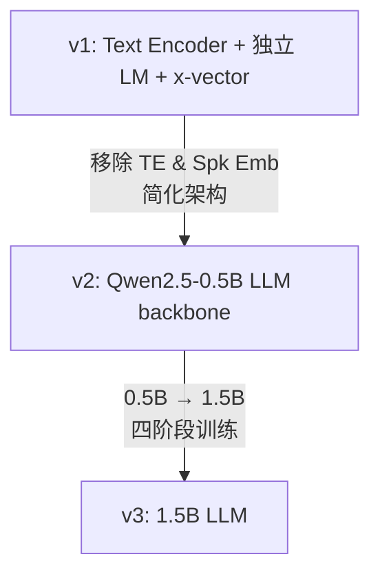
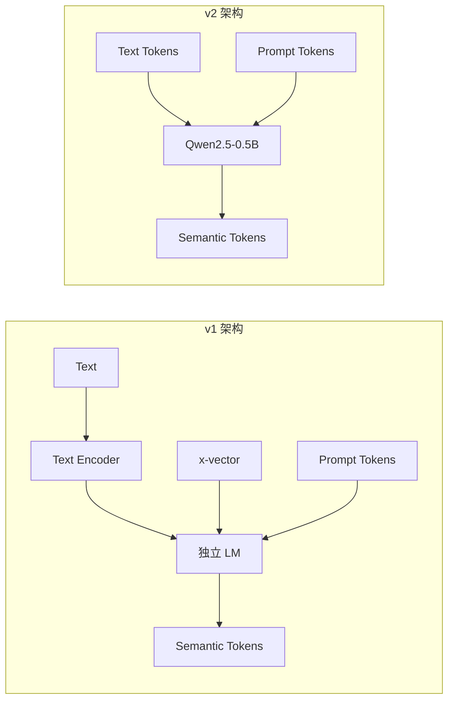

> [!important]
> 
> **一句话定位**：将 TTS 建模为自回归 token 序列生成问题，从独立 LM 到预训练 LLM backbone 到 1.5B 规模化。

---

## LM 在 CosyVoice 中的角色

Text-to-Token LM 是 CosyVoice 两阶段架构的 **Stage 1**，负责将文本转换为语义 token 序列：

$$p(\mathbf{s} | \text{text}, \text{prompt}) = \prod_{t=1}^{T} p(s_t | s_{<t}, \text{text}, \text{prompt})$$

其中 $\mathbf{s} = (s_1, s_2, \ldots, s_T)$ 是目标语义 token 序列，由 Tokenizer 提供训练目标。

### LM 的三个关键职责

1. **内容映射**：文本到语义 token 的对齐

1. **韵律建模**：通过自回归生成捕获停顿、语速、语调

1. **说话人克隆**：通过 In-Context Learning 复制目标音色

## 三代 LM 架构演进

### 架构对比

|**维度**|**v1**|**v2**|**v3**|
|---|---|---|---|
|**Text Encoder**|✅ 独立 BPE Encoder|❌ 移除（LLM 内置）|❌ 移除|
|**Speaker Embedding**|✅ x-vector 注入|❌ 移除（prompt 即音色）|❌ 移除|
|**LM Backbone**|独立 Transformer (~180M)|Qwen2.5-0.5B（预训练）|1.5B LLM|
|**流式支持**|❌|✅ N:M token 交错|✅ 双向流式|
|**输入序列**|[S, v, text, T, speech, E]|text ↔ speech token 交错|同 v2 + mSFT|
|**后训练**|—|DPO|DiffRO|

### v1 → v2 的关键简化

v2 的简化带来三大收益：

- **消除信息泄漏**：移除 x-vector 避免音色信息干扰 token 生成

- **复用预训练知识**：LLM 内置文本理解能力，无需独立 Text Encoder

- **统一流式/非流式**：N:M 交错令牌机制支持多种推理场景

---

### 子页面导航

[[3.1 CosyVoice v1：Text Encoder + 独立 LM + x-vector]]

[[3.2 CosyVoice v2：Qwen2.5-0.5B 预训练 LLM backbone]]

[[3.3 CosyVoice v3：1.5B 参数规模化与训练流水线]]