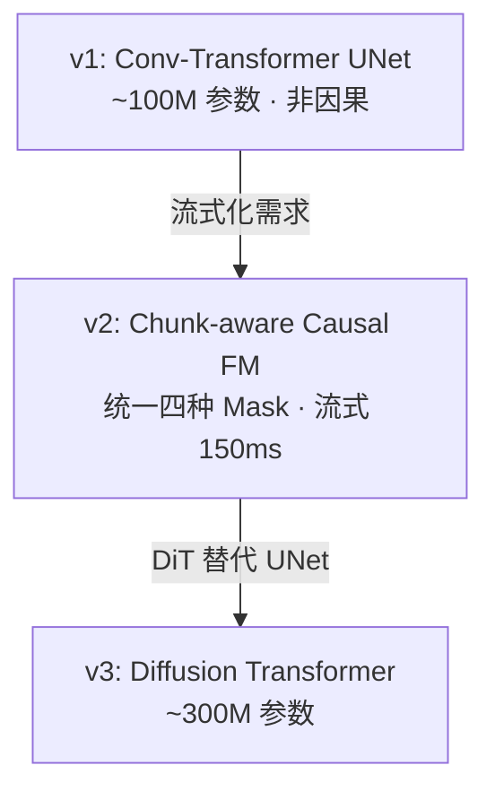

> [!important]
> 
> **一句话定位**：将语义 token 解码为 Mel 频谱图的声学生成模块，三代架构演进（UNet → Causal FM → DiT）。

---

## Flow Matching 在 CosyVoice 中的角色

CFM 是 CosyVoice 两阶段架构的 **Stage 2**，将离散语义 token 解码为连续 Mel 频谱图：

$$\frac{dx_t}{dt} = v_\theta(x_t, t, \mu, \mathbf{s}) \quad t \in [0, 1]$$

其中：

- $x_t$ 是时刻 $t$ 的中间状态（$x_0 sim mathcal{N}(0, I)$，$x_1 approx text{Mel}$）

- $\mu$ 是参考音频的 Mel 特征

- $\mathbf{s}$ 是语义 token 序列

- $v_\theta$ 是神经网络参数化的速度场

### OT-CFM 训练目标

$$\mathcal{L}_{\text{CFM}} = \mathbb{E}_{t, x_0, x_1} \left\| v_\theta(x_t, t, \text{cond}) - (x_1 - x_0) \right\|^2$$

相比 Diffusion，Flow Matching 的优势：

- 直线路径 $x_t = (1-t)x_0 + tx_1$，梯度更简单

- 更少的推理步数（通常 10–20 步 vs Diffusion 50–100 步）

- 训练更稳定

## 三代 FM 架构演进

|**维度**|**v1**|**v2**|**v3**|
|---|---|---|---|
|**Backbone**|Conv-Transformer UNet|Chunk-aware Causal UNet|Diffusion Transformer (DiT)|
|**参数量**|~100M|~100M|~300M|
|**注意力 Mask**|Non-causal (full)|4 种: Non-causal / Full-causal / Chunk-M / Chunk-2M|Non-causal (DiT 自带)|
|**流式支持**|❌|✅ (chunk-level)|✅|
|**上采样**|Transposed Conv|Causal Upsampling + Lookahead PreConv|DiT 内置|
|**CFG**|✅ Classifier-Free Guidance|✅|✅|
|**推理步数**|~10 步|~10 步|~10 步|

### Token 到 Mel 的帧率匹配

语义 token 帧率 25Hz，Mel 帧率 50Hz，需要 2× 上采样：

$$\text{Mel frames} = 2 \times \text{Token frames} \quad (50\text{Hz} = 2 \times 25\text{Hz})$$

v2 的 Causal Upsampling + Lookahead PreConv 设计确保因果性的同时不损失边界信息。

---

### 子页面导航

[[4.1 Optimal-Transport 条件流匹配（OT-CFM）基础]]

[[4.2 CosyVoice v2：Chunk-aware Causal Flow Matching]]

[[4.3 CosyVoice v3：Diffusion Transformer (DiT) 替代 UNet]]