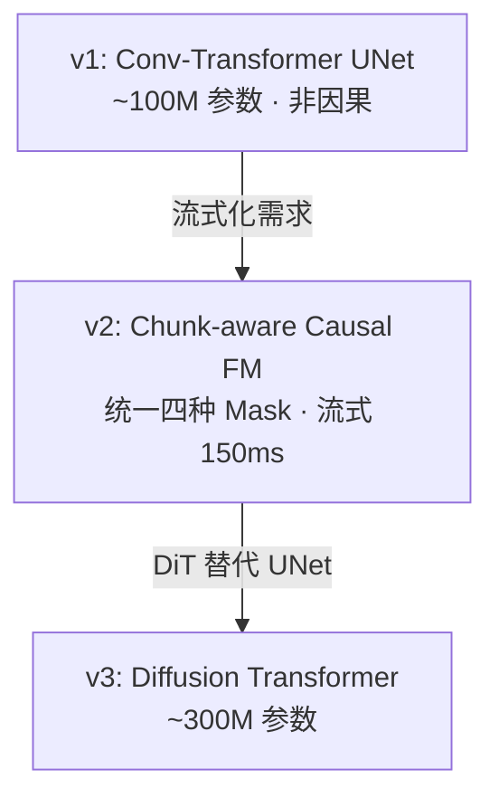

> [!important]
> 
> **一句话定位**：将语义 token 解码为 Mel 频谱图的声学生成模块，三代架构演进（UNet → Causal FM → DiT）。

---

## Flow Matching 在 CosyVoice 中的角色

- LLM 主要建模 **semantic content 和 prosody**
- conditional flow matching 主要补足 **timbre（音色）和 environment（环境）** 等更细的声学信息。

所以你可以把 flow matching 理解成：

> 它接收“说什么”的离散条件，再结合“像谁说、声学上下文长什么样”，把这些高层条件落成真正可听的连续声学表示。

CFM 是 CosyVoice 两阶段架构的 **Stage 2**，将离散语义 token 解码为连续 Mel 频谱图：

$$\frac{dx_t}{dt} = v_\theta(x_t, t, \mu, \mathbf{s}) \quad t \in [0, 1]$$

其中：

- $x_t$ 是时刻 $t$ 的中间状态（$x_0 \sim \mathcal{N}(0, I)$，$x_1 \approx \text{Mel}$）

- $\mu$ 是参考音频的 Mel 特征

- $\mathbf{s}$ 是语义 token 序列

- $v_\theta$ 是神经网络参数化的速度场
### 训练时有哪些条件输入

训练一个样本时，conditional flow matching 模块主要拿四类东西：

#### 3.1 真实 Mel 频谱 $X_1$

这是目标语音的 Mel 频谱，也就是最终想拟合到的数据分布样本。论文把数据分布写成 $q(X)$，而 $X_1$​ 就是从这个真实 Mel 分布里来的样本。

#### 3.2 speaker embedding $v$

这是从同一条语音里通过预训练声纹模型提取出来的 **x-vector / speaker embedding**。  
它告诉 flow matching：**这个 Mel 应该长成哪个说话人的音色**。

#### 3.3 speech tokens $\{\mu_l\}_{1:L}$

这是由 speech tokenizer 从语音里抽出来的 **semantic tokens**。  
它提供的是**内容语义和一部分韵律组织信息**，也就是 flow matching 需要知道“这段语音应该说什么、结构大概怎样”。论文在 Eq. (12) 里明确把 speech tokens 作为条件输入给网络。

#### 3.4 masked Mel $\tilde X_1$

这是非常关键的一项。论文明确说：

> $\tilde X_1$​ 是 $X_1$​ 的 masked version，做法是从一个随机起点开始，把后面连续帧全部置零。

这意味着训练时模型并不是只靠 token 和 speaker embedding，还会看到一段**不完整的真实 Mel 条件**。  
直觉上，这有两个作用：

- 给模型一点局部声学上下文，帮助保持连续性
- 让模型学会“根据前面已知的部分声学信息，补全后面的 Mel”

这也和他们在 zero-shot 推理时利用 **prompt Mel** 维持 timbre / environment consistency 的思路是一脉相承的。

### OT-CFM 训练目标

$$\mathcal{L}_{\text{CFM}} = \mathbb{E}_{t, x_0, x_1} \left\| v_\theta(x_t, t, \text{cond}) - (x_1 - x_0) \right\|^2$$

相比 Diffusion，Flow Matching 的优势：

- 直线路径 $x_t = (1-t)x_0 + tx_1$，梯度更简单

- 更少的推理步数（通常 10–20 步 vs Diffusion 50–100 步）

- 训练更稳定

训练 flow matching 时，目标不是直接预测文字，也不是直接预测 token，而是**学习真实语音 Mel 频谱的分布**。所以对一条训练样本来说，flow matching 的核心目标对象是：

- 真实语音对应的 **Mel spectrogram X1X_1X1​**

你可以把它理解为“终点样本”。训练时模型要学会：从一个简单先验里的随机点出发，如何在条件约束下流动到真实 Mel。

## 三代 FM 架构演进

|**维度**|**v1**|**v2**|**v3**|
|---|---|---|---|
|**Backbone**|Conv-Transformer UNet|Chunk-aware Causal UNet|Diffusion Transformer (DiT)|
|**参数量**|~100M|~100M|~300M|
|**注意力 Mask**|Non-causal (full)|4 种: Non-causal / Full-causal / Chunk-M / Chunk-2M|Non-causal (DiT 自带)|
|**流式支持**|❌|✅ (chunk-level)|✅|
|**上采样**|Transposed Conv|Causal Upsampling + Lookahead PreConv|DiT 内置|
|**CFG**|✅ Classifier-Free Guidance|✅|✅|
|**推理步数**|~10 步|~10 步|~10 步|

### Token 到 Mel 的帧率匹配

语义 token 帧率 25Hz，Mel 帧率 50Hz，需要 2× 上采样：

$$\text{Mel frames} = 2 \times \text{Token frames} \quad (50\text{Hz} = 2 \times 25\text{Hz})$$

v2 的 Causal Upsampling + Lookahead PreConv 设计确保因果性的同时不损失边界信息。

---

### 子页面导航

[[4.1 Optimal-Transport 条件流匹配（OT-CFM）基础]]

[[4.2 CosyVoice v2：Chunk-aware Causal Flow Matching]]

[[4.3 CosyVoice v3：Diffusion Transformer (DiT) 替代 UNet]]