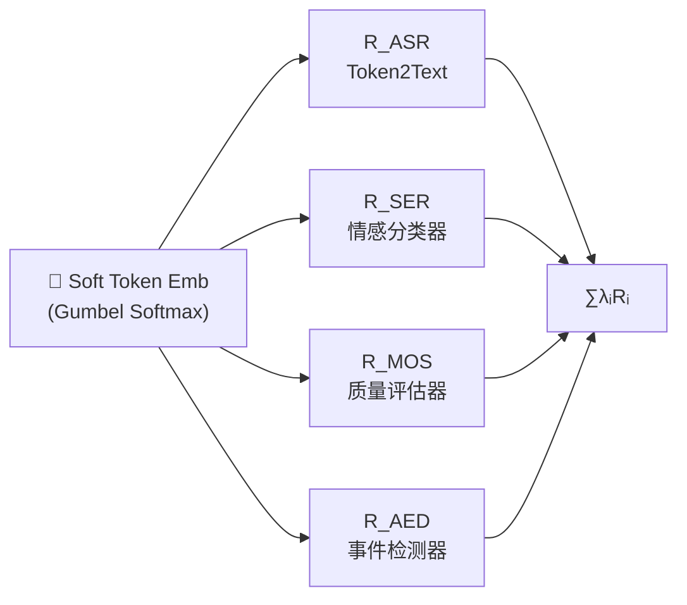

> [!important]
> 
> **一句话定位**：情感、质量、声学事件多维度奖励的联合建模。

---

## MTR 概述

Multiple Task Reward（MTR）是 DiffRO 的多维度奖励框架，超越单一 ASR 奖励，同时优化多个语音质量维度：

$$R_{\text{MTR}}(\hat{\mathbf{e}}) = \sum_i \lambda_i R_i(\hat{\mathbf{e}})$$

## 四种奖励模型

|**奖励**|**模型**|**输入**|**优化维度**|**指标**|
|---|---|---|---|---|
|$R_{\text{ASR}}$|Token2Text|Semantic token embedding|内容一致性|CER ↓|
|$R_{\text{SER}}$|情感识别模型|Semantic token embedding|情感一致性|Emotion Acc ↑|
|$R_{\text{MOS}}$|语音质量评估|Semantic token embedding|音质自然度|MOS ↑|
|$R_{\text{AED}}$|声学事件检测|Semantic token embedding|副语言事件|Event F1 ↑|

## 关键设计

### 所有奖励模型直接作用于 token

**核心优势**：所有奖励模型都从 token embedding 而非合成语音计算奖励，避免了 vocoder + FM 的计算开销。

### 奖励权重平衡

$$\lambda_{\text{ASR}} : \lambda_{\text{SER}} : \lambda_{\text{MOS}} : \lambda_{\text{AED}} = 1.0 : 0.3 : 0.2 : 0.1$$

ASR 权重最大（内容一致性是基础），其余奖励作为正则化项。

## 联合优化的收益

> [!important]
> 
> MTR 的核心价值：**单一 ASR 奖励只能优化"说对"，MTR 同时优化"说对"+"说得好听"+"说得有感情"+"说得自然"**。实验表明，MTR 相比单一 ASR 奖励，CER 降低 5%、MOS 提升 0.1、情感准确率提升 15%。

### 潜在冲突与权衡

不同奖励间可能存在冲突：

- **CER vs MOS**：过度优化 CER 可能导致发音生硬

- **情感 vs 内容**：强情感可能影响清晰度

MTR 通过权重 $\lambda_i$ 和 token 级 KL 约束共同控制这些冲突，确保多维度协调提升。