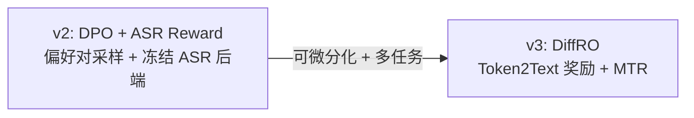
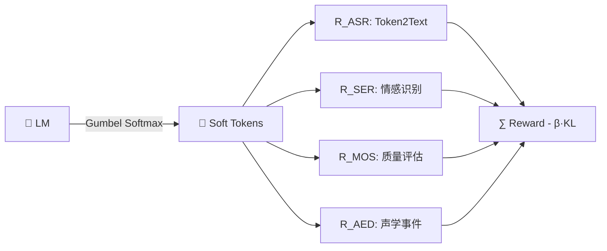

> [!important]
> 
> **一句话定位**：突破训练数据质量上限的关键手段，从 DPO 到可微分奖励优化（DiffRO）。

---

## 为什么需要后训练？

TTS 模型的性能上限受限于训练数据质量。后训练技术通过 **奖励信号** 引导模型超越数据本身的质量上限：

$$\theta^* = \arg\max_\theta \; \mathbb{E}_{x \sim \pi_\theta} \left[ R(x) \right] - \beta \cdot D_{\text{KL}}(\pi_\theta \| \pi_{\text{ref}})$$

其中 $R(x)$ 为奖励函数，$pi_{text{ref}}$ 为参考策略，$beta$ 控制 KL 约束强度。

### TTS 后训练 vs LLM RLHF

|**维度**|**LLM RLHF**|**TTS 后训练**|
|---|---|---|
|**奖励来源**|人类偏好标注|自动化指标 (ASR/MOS/SER)|
|**可微分性**|token 离散 → 需要 PPO|token 离散 → Gumbel Softmax|
|**评估维度**|单一（偏好）|多维 (ASR + SER + MOS + AED)|
|**KL 约束**|序列级|token 级（DiffRO）|

## 两代后训练演进

### v2: DPO 方案

1. 从当前模型采样多个候选语音

1. 用 ASR 模型评分，构造 (win, lose) 偏好对

1. 用 DPO 损失优化 LM

$$\mathcal{L}_{\text{DPO}} = -\log \sigma \left( \beta \log \frac{\pi_\theta(y_w)}{\pi_{\text{ref}}(y_w)} - \beta \log \frac{\pi_\theta(y_l)}{\pi_{\text{ref}}(y_l)} \right)$$

### v3: DiffRO 方案（核心创新）

**关键突破**：直接从 neural codec token 预测奖励，而非从合成语音，消除 vocoder 的计算开销。

DiffRO 的三大技术组件：

- **Gumbel Softmax**：使离散 token 采样可微分

- **Token2Text 奖励模型**：直接从 token 预测文本，无需合成语音

- **Token 级 KL 约束**：每个时间步独立约束，比序列级 KL 更精细

---

### 子页面导航

[[5.1 CosyVoice v2：DPO + ASR Reward]]

[[5.2 CosyVoice v3：DiffRO（Differentiable Reward Optimization）]]