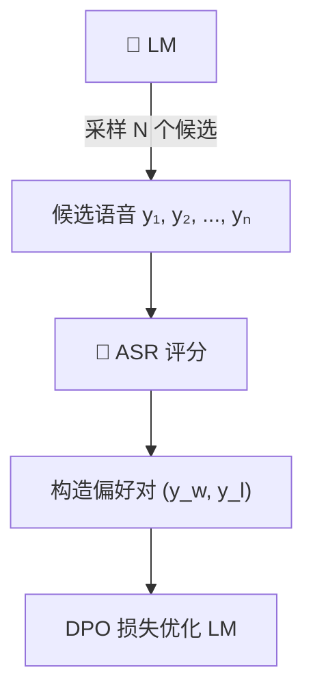

> [!important]
> 
> **一句话定位**：偏好对采样、Gumbel Softmax 可微 ASR 奖励、冻结 ASR 后端。

---

## DPO 在 TTS 中的应用

CosyVoice v2 首次将 DPO（Direct Preference Optimization）应用于 TTS 后训练：

### 流程

### DPO 损失函数

$$\mathcal{L}_{\text{DPO}} = -\log \sigma \left( \beta \left[ \log \frac{\pi_\theta(y_w | x)}{\pi_{\text{ref}}(y_w | x)} - \log \frac{\pi_\theta(y_l | x)}{\pi_{\text{ref}}(y_l | x)} \right] \right)$$

- $y_w$: ASR 评分更高的"胜者"

- $y_l$: ASR 评分更低的"败者"

- $pi_{text{ref}}$: 冻结的参考模型

- $beta$: 温度参数

### ASR Reward 设计

使用 **冻结的 ASR 模型后端** 作为奖励函数：

$$R_{\text{ASR}}(y) = -\text{CER}(\text{ASR}(y), \text{text})$$

通过 Gumbel Softmax 使 token 采样可微分，实现端到端梯度反传。

## 局限性

- **单维度奖励**：仅用 ASR 评分，无法优化情感、音质等维度

- **偏好对质量**：依赖采样多样性，偏好对可能噪声大

- **序列级 KL**：约束粒度较粗

> [!important]
> 
> 这些局限直接驱动了 v3 中 **DiffRO** 的提出：多任务奖励 + token 级 KL 约束。