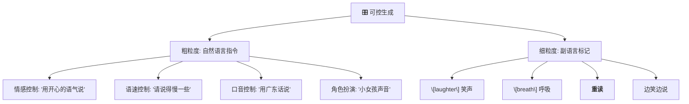
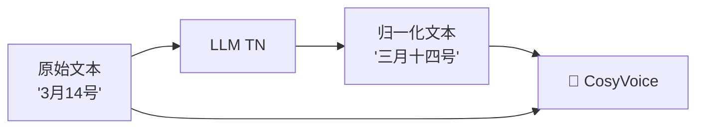

> [!important]
> 
> **一句话定位**：自然语言指令控制情感/语速/口音/角色、细粒度副语言标记、发音修补与文本归一化。

---

## 可控生成的两个层次

CosyVoice 的可控生成分为 **粗粒度** 和 **细粒度** 两个层次：



### 指令格式

```JavaScript
<|endofprompt|>自然语言指令<|endofprompt|>文本内容
```

示例：

- `<|endofprompt|>用开心的语气说<|endofprompt|>今天天气真好！`

- `<|endofprompt|>请用广东话说<|endofprompt|>你好，请问有什么可以帮到你？`

### 细粒度标记设计

|**标记**|**含义**|**示例**|
|---|---|---|
|`\[laughter\]`|插入笑声|哈哈[laughter]你真有趣|
|`\[breath\]`|插入呼吸声|我觉得[breath]这个想法不错|
|`<strong>...<\/strong>`|重读/强调|这是<strong>非常重要</strong>的|
|`<laughter>...<\/laughter>`|边笑边说|<laughter>你怎么这样</laughter>|

## v3 扩展功能

### 发音修补（Pronunciation Inpainting）

解决多音字和生僻词发音问题，使用混合词-音素序列建模：

```JavaScript
输入: “乐(不确定发音)山” → “乐(lè) 山”
```

### 自训练文本归一化（Self-training TN）

用 LLM 做文本归一化（Text Normalization）数据增强，实现端到端原始文本输入：



---

### 子页面导航

[[6.1 自然语言指令与细粒度标记设计]]

[[6.2 CosyVoice v3 扩展：发音修补（Pronunciation Inpainting）]]

[[6.3 CosyVoice v3 扩展：自训练文本归一化（Self-training TN）]]