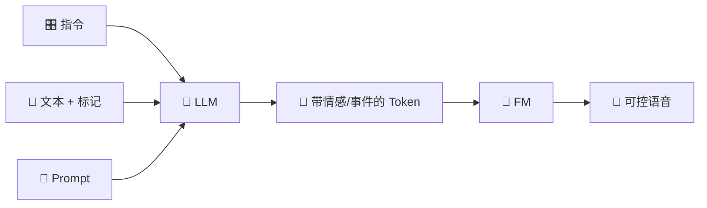

> [!important]
> 
> **一句话定位**：`<|endofprompt|>` 格式、`[laughter]`/`[breath]`、`<strong>`/`<laughter>` 标签详解。

---

## 指令控制体系

CosyVoice 的指令控制分为两个层次：

### 粗粒度：自然语言指令

通过 `<|endofprompt|>` 分隔指令和内容：

```JavaScript
<|endofprompt|>{自然语言指令}<|endofprompt|>{文本内容}
```

**支持的指令类型**：

|**类型**|**示例指令**|**效果**|
|---|---|---|
|情感控制|用开心的语气说|生成愉悦的语音|
|语速控制|请说得慢一些|降低语速|
|口音控制|用广东话说|方言合成|
|角色扮演|用小女孩的声音说|音色变化|
|风格控制|用新闻播报的风格|正式播报风格|

### 细粒度：副语言标记

在文本中插入特殊标记控制非语言事件：

|**标记**|**类型**|**使用方式**|**示例**|
|---|---|---|---|
|`[laughter]`|插入型|在文本中插入笑声|哈哈`[laughter]`你真逗|
|`[breath]`|插入型|在文本中插入呼吸|我觉得`[breath]`这个好|
|`<strong>...</strong>`|包围型|重读/强调标记|这是`<strong>`很重要`</strong>`的|
|`<laughter>...</laughter>`|包围型|边笑边说|`<laughter>`你太搞笑了`</laughter>`|

## 实现原理

指令控制依赖两个关键机制：

1. **Tokenizer 编码**：多任务 FSQ-MinMo 能编码情感和声学事件信息

1. **LLM 理解**：预训练 LLM 理解自然语言指令的语义

1. **mSFT 微调**：将指令遵循能力迁移到特定说话人

