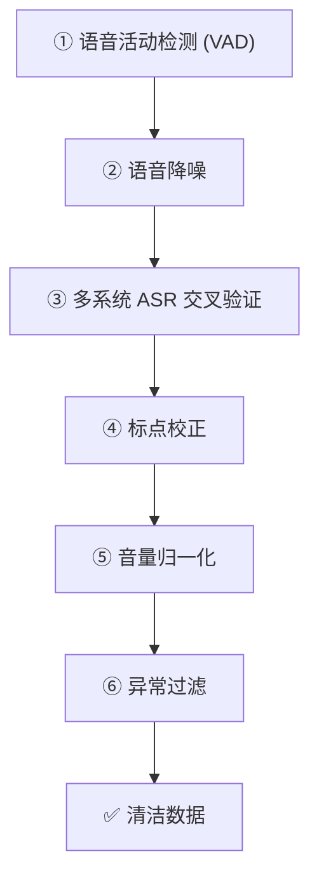

> [!important]
> 
> **一句话定位**：从 170K 小时到 1M 小时，从中英到 9 语言 + 18 方言的数据工程与多语言能力扩展。

---

## 数据规模演进

|**维度**|**v1**|**v3**|
|---|---|---|
|**数据量**|170K 小时|1M 小时|
|**语言**|中文、英文|9 语言 (中/英/日/韩/粤/法/德/西/意)|
|**方言**|—|18 种中文方言|
|**数据源**|有声书 + 播客|有声书 + 播客 + 电影 + 播报 + 网络音频|

## 数据处理流水线（6 步）

|步骤|操作|目的|
|---|---|---|
|①|VAD 语音活动检测|切分语音段落，去除静音|
|②|语音降噪|去除背景噪声、混响|
|③|多系统 ASR 交叉验证|用多个 ASR 系统交叉验证转写质量|
|④|标点校正|修复标点符号错误|
|⑤|音量归一化|统一音量级别|
|⑥|异常过滤|去除断句、演唱、无效数据|

## Scaling Law 观察

CosyVoice v3 验证了语音合成领域的 Scaling Law：

- **数据量 ↑**：内容一致性和音色相似度显著提升

- **模型参数 ↑**：0.5B → 1.5B，韵律自然度提升

- **语言多样性 ↑**：跨语言合成能力增强

## mSFT（多说话人微调）

mSFT 是 CosyVoice v3 的关键训练策略：从大规模预训练模型出发，对特定说话人进行联合微调，实现：

- **单语说话人多语化**：让仅有中文数据的说话人能说英文

- **指令能力迁移**：将情感控制能力迁移到新说话人

- **方言支持**：让模型支持 18 种中文方言

---

### 子页面导航

[[7.1 多语言数据处理流水线（6 步）]]

[[7.2 Speaker Fine-tuning（mSFT）与能力迁移]]