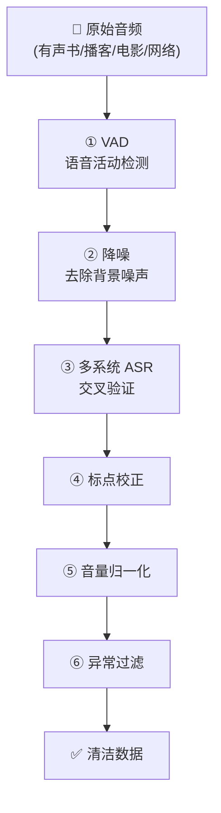

> [!important]
> 
> **一句话定位**：语音检测 → 降噪 → 多系统 ASR 交叉验证 → 标点校正 → 音量归一化 → 异常过滤。

---

## 流水线总览

## 各步骤详解

### ① VAD（Voice Activity Detection）

- **目的**：切分语音段落，去除静音和非语音部分

- **输出**：固定长度（10~30s）的语音片段

- **工具**：基于能量 + 神经网络的混合 VAD

### ② 语音降噪

- **目的**：去除背景噪声、混响、音乐

- **方法**：基于深度学习的语音增强模型

- **效果**：提升后续 ASR 的准确率

### ③ 多系统 ASR 交叉验证

> [!important]
> 
> 这是数据质量控制的**核心步骤**：用多个独立 ASR 系统分别转写，仅保留多个系统一致的结果。

- 使用 2~3 个不同的 ASR 系统

- 计算转写结果的一致性（CER < 阈值）

- 不一致的样本被丢弃

### ④ 标点校正

- 修复 ASR 输出中的标点错误

- 统一标点符号风格

### ⑤ 音量归一化

- 将所有音频的音量统一到标准 LUFS

- 避免音量差异影响模型训练

### ⑥ 异常过滤

过滤以下类型的异常数据：

- 断句不完整的片段

- 含演唱/音乐的片段

- 过短（<1s）或过长（>30s）的片段

- 信噪比过低的片段

## 数据质量 vs 数量的权衡

> 经验法则：**宁缺毋滥**。CosyVoice 团队发现，严格的数据过滤（即使丢弃 50% 的数据）比使用全部噪声数据的效果更好。