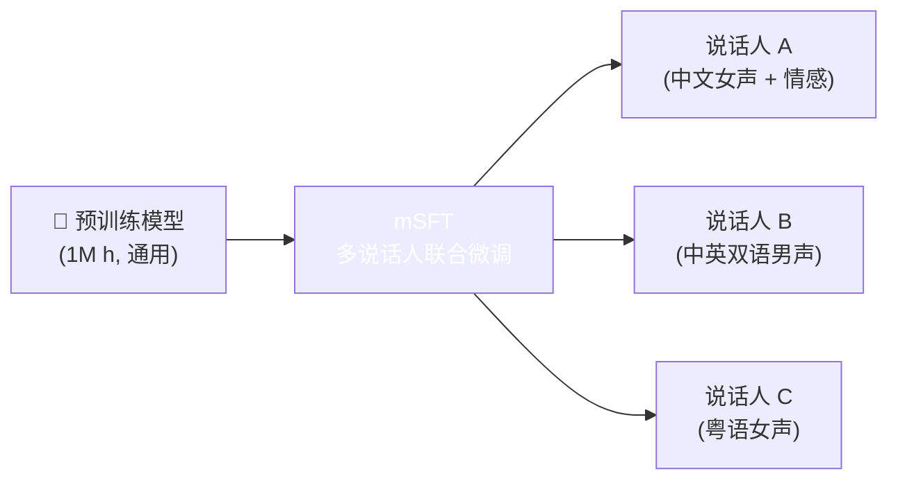
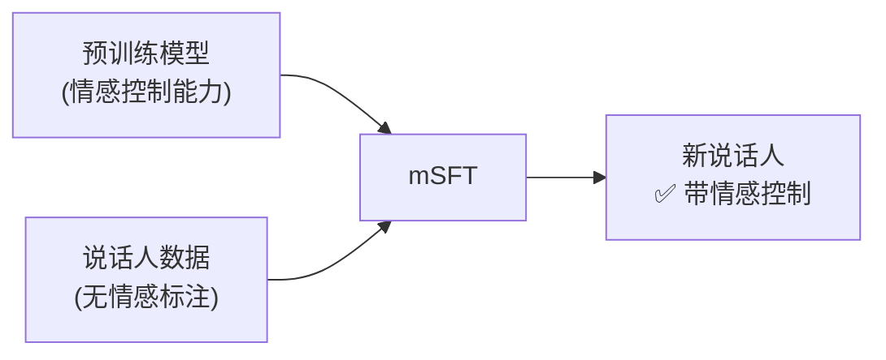

> [!important]
> 
> **一句话定位**：多说话人联合微调、单语说话人多语化、指令能力迁移策略。

---

## mSFT 概述

mSFT（Multi-Speaker Fine-Tuning）是 CosyVoice v3 的关键训练策略，从大规模预训练模型出发，对**多个目标说话人联合微调**。

## 三大核心能力

### 1. 单语说话人多语化

让仅有中文数据的说话人能说英文、日文等：

$$\text{mSFT}(\text{Speaker}_{\text{zh-only}}, \text{Data}_{\text{multilingual}}) \to \text{Speaker}_{\text{multilingual}}$$

**原理**：预训练模型已学会多语言映射，mSFT 将特定音色与多语言能力绑定。

### 2. 指令能力迁移

将情感控制、语速控制等能力迁移到新说话人：

### 3. 方言支持

让模型支持 18 种中文方言：

|**方言类别**|**示例**|
|---|---|
|官话|东北话、四川话、河南话|
|吴语|上海话、苏州话|
|粤语|广州话、香港粤语|
|闽语|闽南话、潮汕话|
|其他|客家话、湘语等|

## mSFT 的关键设计

- **联合微调**：多个说话人同时微调，避免灾难性遗忘

- **数据配比**：精标数据（目标说话人）+ 通用数据（保持泛化）按比例混合

- **学习率策略**：使用较小学习率，避免破坏预训练表征