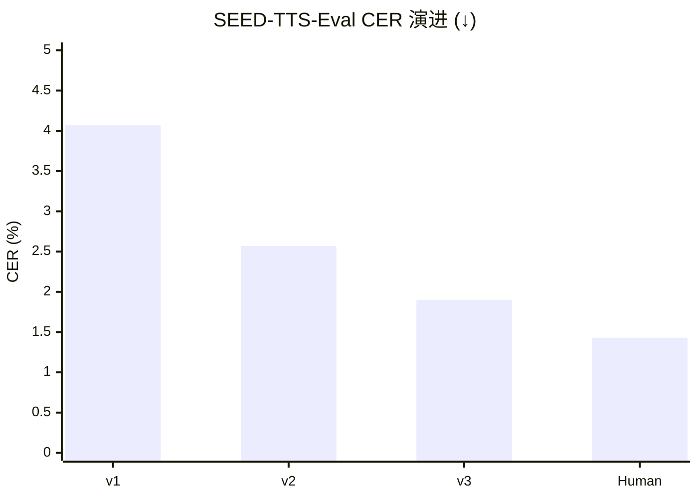

> [!important]
> 
> **一句话定位**：三代模型在 SEED-TTS-Eval、LibriSpeech、CV3-Eval 等基准上的性能演进。

---

## 评估指标体系

|**指标**|**全称**|**衡量维度**|**方向**|
|---|---|---|---|
|**CER / WER**|Character / Word Error Rate|内容一致性|↓ 越低越好|
|**SIM**|Speaker Similarity|说话人相似度|↑ 越高越好|
|**MOS**|Mean Opinion Score|韵律自然度 + 音质|↑ 越高越好 (1–5)|
|**SS**|Speaker Similarity (Seed-TTS)|说话人相似度|↑ 越高越好|

## SEED-TTS-Eval 三代横评

|**模型**|**test-zh CER↓**|**test-en WER↓**|**test-hard CER↓**|**SIM↑**|
|---|---|---|---|---|
|CosyVoice v1|2.24%|4.26%|4.07%|0.730|
|CosyVoice v2|1.45%|2.57%|2.57%|0.748|
|**CosyVoice v3**|**1.12%**|**2.08%**|**1.90%**|**0.762**|
|MaskGCT|2.27%|2.62%|—|0.717|
|F5-TTS|1.56%|1.83%|—|0.670|
|Ground Truth|1.26%|2.14%|1.43%|—|

> [!important]
> 
> **关键观察**：CosyVoice v3 在 test-zh 上的 CER (1.12%) 已接近人类录音 (1.26%)，在 test-hard 上 CER 从 v1 的 4.07% 降至 1.90%，相对降低 53%。

## 三代性能演进趋势

---

### 子页面导航

[[8.1 SEED-TTS-Eval 横评（test-zh - test-en - test-hard）]]

[[8.2 CV3-Eval 多语言基准（9 语言 + 跨语言 + 情感）]]

[[8.3 模块消融实验总结]]