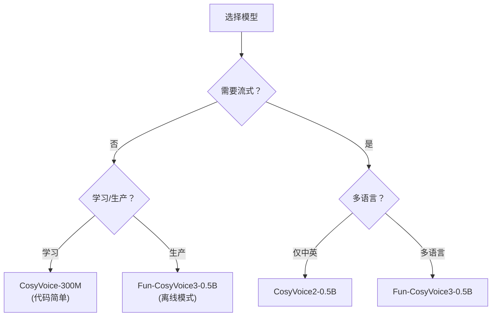

> [!important]
> 
> **一句话定位**：CosyVoice-300M / CosyVoice2-0.5B / Fun-CosyVoice3-0.5B 选型指南。

---

## 开源模型版本

|**版本**|**参数**|**流式**|**语言**|**情感**|**推荐场景**|
|---|---|---|---|---|---|
|CosyVoice-300M|300M|❌|中英|✅ 基础|学习研究 · 离线合成|
|CosyVoice-300M-SFT|300M|❌|中英日粤韩|❌|多语言离线|
|CosyVoice-300M-Instruct|300M|❌|中英|✅ 指令|可控生成研究|
|CosyVoice2-0.5B|0.5B|✅|中英|✅|实时对话 · 低延迟|
|**Fun-CosyVoice3-0.5B**|0.5B|✅|**9语言+18方言**|**✅ 9情感**|**生产首选**|

## 选型决策树

## 部署方式

|方式|说明|
|---|---|
|**本地 Python**|`pip install cosyvoice` • HuggingFace 权重|
|**Docker**|官方 Dockerfile，GPU 支持|
|**阿里云 API**|DashScope 在线服务|
|**SiliconFlow**|第三方托管 API|

## 推理优化

- **JIT 编译**：`load_jit=True` 加速推理

- **TensorRT**：`load_trt=True`（需 NVIDIA GPU）

- **半精度**：FP16 推理，显存减半

- **流式合成**：`stream=True`，逐 chunk 输出