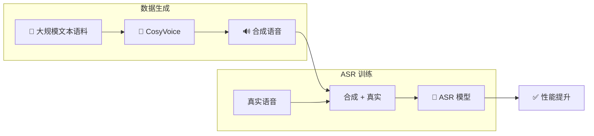

> [!important]
> 
> **一句话定位**：合成数据 + 真实数据联合训练提升 ASR 性能的实验验证。

---

## 背景

高质量 TTS 系统不仅是语音合成工具，还可以作为 **ASR 数据增强** 的数据生成器。

## 实验设计

CosyVoice 论文验证了以下实验：

|**实验条件**|**训练数据**|**ASR 性能**|
|---|---|---|
|仅真实数据|X 小时真实语音|Baseline|
|真实 + 合成|X 小时真实 + Y 小时合成|显著提升|
|合成数据（不同文本）|X 小时真实 + Y 小时合成（新文本）|**最大提升**|

## 关键发现

> [!important]
> 
> **文本多样性比语音时长更重要**：使用新文本语料合成的数据（文本多样性高）比简单重复合成现有文本的效果好得多。这说明 CosyVoice 合成数据的主要价值在于引入**多样化的语言内容**。

### 应用场景

1. **低资源语言**：对训练数据稀缺的语言，用 CosyVoice 合成大量数据

1. **领域适配**：合成特定领域（医疗、法律）的文本语料

1. **数据平衡**：补充长尾场景的训练数据

1. **隐私保护**：用合成数据替代真实录音，保护说话人隐私