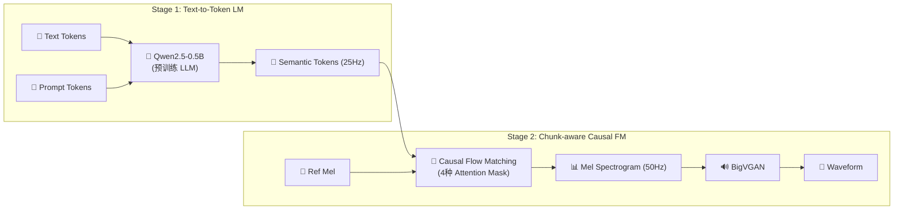

## 1. 论文概述
![[Pasted image 20260412151312.png]]
CosyVoice 2 是 CosyVoice 系列的第二代，核心目标是在保持高质量的同时实现**低延迟流式合成**，并通过系统性优化全面提升内容一致性和说话人相似度。

> [!important]
> 
> **核心亮点**：引入 FSQ 替代 VQ（codebook 利用率 100%）；移除 Text Encoder 和 Speaker Embedding，直接复用预训练 Qwen2.5-0.5B 作为 LM backbone；提出统一流式/非流式框架（150ms 首包延迟）；引入 DPO 后训练。CER 相比 v1 降低 35%。

---

## 2. 核心架构

### v1 → v2 关键改进

|**维度**|**v1**|**v2 改进**|
|---|---|---|
|**Tokenizer**|VQ · codebook 利用率 23%|**FSQ · 利用率 100%** · 消除 codebook collapse|
|**编码器**|SenseVoice|**SenseVoice-Large**（更强多语言 ASR）|
|**LM**|独立 Transformer + Text Encoder + x-vector|**Qwen2.5-0.5B**（移除 TE & Spk Emb）|
|**流式**|❌ 仅离线|**✅ 统一流式/非流式** · N:M token 交错 · 150ms 首包|
|**FM**|Non-causal UNet|**Chunk-aware Causal FM** · 4 种 mask|
|**后训练**|—|**DPO + ASR Reward**|

---

## 3. 关键技术详解

### 3.1 有限标量量化（FSQ）

用**低秩投影 + 有界取整**替代 VQ 的 codebook 查找：

$$\bar{H} = \text{Round}(\text{Proj}_{\text{down}}(H)), \quad \hat{H} = \text{Proj}_{\text{up}}(\bar{H})$$

- 隐式 codebook 大小：$(2K+1)^d$（全部可用，无 collapse）

- 无需 codebook 学习，投影层通过梯度反传优化

### 3.2 统一流式/非流式 LM

**N:M Token 交错**：每 N 个文本 token 对应 M 个语音 token，交替生成，支持四种推理场景：

|**场景**|**文本**|**语音**|**典型用途**|
|---|---|---|---|
|非流式|全部输入|全部生成|离线 TTS|
|语音流式|全部输入|流式输出|文本已知的 TTS|
|双向流式|流式输入|流式输出|**LLM 对话场景**|
|文本流式|流式输入|全部生成|实时字幕|

**首包延迟模型**：

$$L_{\text{TTS}} = M \cdot (d_{\text{lm}} + d_{\text{fm}} + d_{\text{voc}}) \approx 150\text{ms}$$

### 3.3 Chunk-aware Causal FM

四种注意力掩码统一流式/离线：

|Mask|因果性|前瞻|场景|
|---|---|---|---|
|Non-causal|❌|全局|离线（最优质量）|
|Full-causal|✅|0|最低延迟|
|Chunk-M|✅|M 帧|**平衡（推荐）**|
|Chunk-2M|✅|2M 帧|高质量流式|

训练时随机选择 mask，产生**隐式自蒸馏**效应：Non-causal 作为"教师"，Causal/Chunk 作为"学生"。

### 3.4 DPO 后训练

1. 从当前模型采样多个候选语音

2. 用冻结 ASR 模型评分，构造偏好对

3. DPO 损失优化 LM

$$\mathcal{L}_{\text{DPO}} = -\log \sigma \left( \beta \left[ \log \frac{\pi_\theta(y_w)}{\pi_{\text{ref}}(y_w)} - \log \frac{\pi_\theta(y_l)}{\pi_{\text{ref}}(y_l)} \right] \right)$$

---

## 4. 实验结果

### SEED-TTS-Eval

|**模型**|**test-zh CER↓**|**test-en WER↓**|**test-hard CER↓**|**SIM↑**|
|---|---|---|---|---|
|CosyVoice v1|2.24%|4.26%|4.07%|0.730|
|**CosyVoice v2**|**1.45%**|**2.57%**|**2.57%**|**0.748**|
|_相对提升_|_↓35%_|_↓40%_|_↓37%_|_↑2.5%_|

### 流式性能

- **首包延迟**：~150ms（Chunk-M 模式）

- **MOS**：从 v1 的 5.4 提升至 **5.53**

- **发音错误率**：相比 v1 降低 30%–50%

- **流式 vs 离线质量差距**：MOS 仅差 0.02，几乎无感知

---

## 5. 消融实验关键结论

|**消融项**|**CER 变化**|**结论**|
|---|---|---|
|LLM init → 随机初始化|↑30%|预训练 LLM 权重贡献最大|
|FSQ → VQ|↑23%|FSQ 消除 codebook collapse|
|移除 DPO|↑12%|后训练提供稳定增益|
|保留 x-vector|↑5%|移除 spk emb 提升韵律自然度|

---

## 6. 开源信息

- **GitHub**：[FunAudioLLM/CosyVoice](https://github.com/FunAudioLLM/CosyVoice)

- **HuggingFace**：`FunAudioLLM/CosyVoice2-0.5B`

- **论文**：[arXiv:2412.10117](https://arxiv.org/abs/2412.10117)

- **官方 Demo**：[funaudiollm.github.io/cosyvoice2](http://funaudiollm.github.io/cosyvoice2)