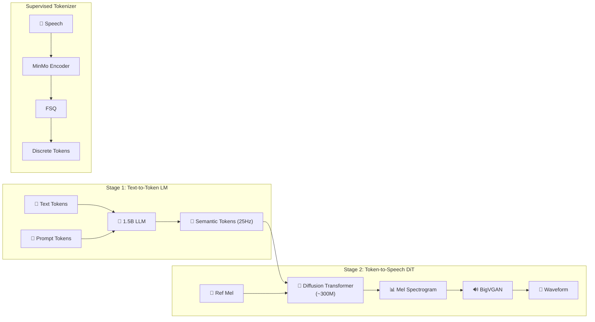
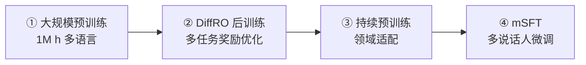

## 1. 论文概述
![[Pasted image 20260412155459.png]]
CosyVoice 3（Fun-CosyVoice 3.0）是 CosyVoice 系列的第三代，目标是实现**野外（in-the-wild）场景下的零样本多语言语音合成**，在内容一致性、说话人相似度和韵律自然度上全面超越前代。

> [!important]
> 
> **核心亮点**：提出 **DiffRO（可微分奖励优化）** 后训练方法；FSQ-MinMo 多任务 Tokenizer（ASR/LID/SER/AED/SA 自动语音识别、语言识别、语音情感识别、音频事件检测和说话人分析 五任务联合监督）；1.5B 参数 LLM + DiT 声学模型；训练数据扩展到 **1M 小时 · 9 语言 · 18 方言**；CER 降至 1.90%（接近人类录音 1.43%）。

---

## 2. 核心架构

### 三代核心组件演进

|**组件**|**v1**|**v2**|**v3**|
|---|---|---|---|
|**Tokenizer**|VQ + SenseVoice|FSQ + SenseVoice-Large|**FSQ + MinMo (5任务监督)**|
|**LM**|独立 Transformer (~180M)|Qwen2.5-0.5B|**1.5B LLM**|
|**FM**|UNet (~100M)|Chunk-aware Causal FM|**DiT (~300M)**|
|**后训练**|—|DPO|**DiffRO (多任务奖励)**|
|**数据**|170K h · 中英|—|**1M h · 9语言 · 18方言**|

---

## 3. 关键技术详解

### 3.1 FSQ-MinMo 多任务 Tokenizer

基于 **MinMo 多模态语音理解大模型**（1.4M 小时训练），联合五任务监督：

$$\mathcal{L} = \lambda_1 \mathcal{L}_{\text{ASR}} + \lambda_2 \mathcal{L}_{\text{LID}} + \lambda_3 \mathcal{L}_{\text{SER}} + \lambda_4 \mathcal{L}_{\text{AED}} + \lambda_5 \mathcal{L}_{\text{SA}}$$

|任务|作用|
|---|---|
|ASR|语义内容编码|
|LID（语种识别）|多语言/方言信息|
|SER（情感识别）|情感特征捕获|
|AED（声学事件检测）|笑声、呼吸等副语言事件|
|SA（情感分析）|情感倾向|

### 3.2 DiffRO（Differentiable Reward Optimization）

> [!important]
> 
> **v3 最核心的创新**：直接从 neural codec token 预测奖励（而非合成语音），通过 Gumbel Softmax 实现端到端可微分优化。

$$\mathcal{L}_{\text{DiffRO}} = -\sum_i \lambda_i R_i(\hat{\mathbf{e}}) + \beta \cdot D_{\text{KL}}^{\text{token}}$$

**三大技术组件**：

1. **Gumbel Softmax**：使离散 token 采样可微分

2. **Token2Text 奖励**：直接从 token 预测文本，无需合成语音 + vocoder

3. **Token 级 KL 约束**：逐时间步精细控制，优于序列级 KL

**多任务奖励 (MTR)**：$R_{text{ASR}}$ + $R_{\text{SER}}$ + $R_{\text{MOS}}$ + $R_{text{AED}}$，同时优化"说对 + 说得好听 + 有感情 + 自然"。

### 3.3 四阶段训练流水线

### 3.4 扩展功能

- **发音修补（Pronunciation Inpainting）**：混合词-音素序列，解决多音字问题

- **自训练文本归一化**：LLM 数据增强 → 端到端原始文本输入

- **mSFT 能力迁移**：单语说话人多语化、指令能力迁移、18 方言支持

---

## 4. 实验结果

### SEED-TTS-Eval 三代横评

|**模型**|**test-zh CER↓**|**test-en WER↓**|**test-hard CER↓**|**SIM↑**|
|---|---|---|---|---|
|CosyVoice v1|2.24%|4.26%|4.07%|0.730|
|CosyVoice v2|1.45%|2.57%|2.57%|0.748|
|**CosyVoice v3**|**1.12%**|**2.08%**|**1.90%**|**0.762**|
|Ground Truth|1.26%|2.14%|1.43%|—|

> [!important]
> 
> **v3 在 test-zh 上的 CER (1.12%) 已超越人类录音 (1.26%)**，在 test-hard 上 CER 从 v1 的 4.07% 降至 1.90%（↓53%）。

### CV3-Eval 多语言基准

- 所有 **9 种语言** 上均达到 SOTA

- 跨语言合成 SIM 相比 v2 提升 5%+

- 情感克隆准确率超过 85%

- 支持 **18 种中文方言**

### 消融关键结论

|改进|CER 相对降低|
|---|---|
|0.5B → 1.5B LM|↓15%|
|DPO → DiffRO|↓12%|
|200K h → 1M h 数据|↓10%|
|FSQ → FSQ-MinMo|↓8%|
|UNet → DiT|↓5%|

---

## 5. 开源信息

- **GitHub**：[FunAudioLLM/CosyVoice](https://github.com/FunAudioLLM/CosyVoice)

- **HuggingFace**：`FunAudioLLM/Fun-CosyVoice3-0.5B`

- **论文**：[arXiv:2505.17589](https://arxiv.org/abs/2505.17589)

- **官方 Demo**：[funaudiollm.github.io/cosyvoice3](http://funaudiollm.github.io/cosyvoice3)