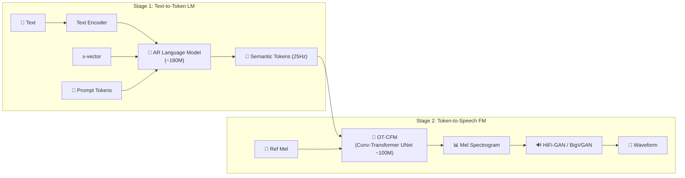

## 1. 论文概述

CosyVoice 是阿里通义实验室推出的首个基于 **监督语义 Token** 的多语言零样本 TTS 系统，开创了“Hybrid 两阶段”范式（语义 LM + 流匹配声学模型）的先河。

> [!important]
> 
> **核心亮点**：首次提出将向量量化插入 ASR 编码器中间层获取监督语义 token；支持零样本语音克隆、跨语言合成、指令式可控生成、细粒度副语言控制；170K 小时中英语音数据训练，300M 参数规模。

![[Pasted image 20260412100911.png]]
论文在 introduction 明说：引入 x-vector 后，作者希望把语音建模拆成 **semantic语义、speaker说话人、prosody韵律** 三部分；其中 LLM 主要建模**语义内容和韵律**，而 conditional flow matching 更偏向捕获**音色（timbre）和环境信息**。所以从系统角度看：

- `Text Y` + 部分上下文 → 帮助 LLM 生成正确 speech tokens

- `v` + tokens + prompt Mel → 帮助 flow matching 把 token 落成“某个人在某种环境下的真实声音”

### 语义、说话人、韵律
#### 1. semantic 是什么

^c9a4bb

这里的 **semantic** 不要理解成 NLP 里特别抽象的“句子深层语义”。在 CosyVoice 这篇论文里，它更接近：

> **语音里承载文本内容的那部分信息**，也就是“这段话在说什么”。

例如一句话是“今天天气很好”：

- semantic 关心的是：这几个词、这些音节、这个语言内容
- 它尽量不关心：是谁说的、声音是粗还是细、开心还是难过、说得快还是慢

所以在 TTS 里，论文说的 semantic 往往更接近“**内容信息 / linguistic content**”，而不是纯哲学意义上的“语义”。论文也反复强调，他们想要的 token 要和文本更对齐，提升 **content consistency**。

#### 2. speaker 是什么

**speaker** 指的是说话人身份相关的信息，也就是“像谁在说”。

它通常包括这些比较稳定的特征：

- 音色、声线
- 声道结构带来的声音个体差异
- 某些稳定的口音/发声习惯

在 CosyVoice 里，这部分主要通过从参考语音中提取的 **speaker embedding `v`** 来提供。论文在 2.2 节里明确说，`v` 是用预训练 **voice-print model** 从语音里提取出来的 speaker embedding。

#### 3. prosody 是什么

**prosody** 是“怎么说”的那部分，主要是韵律层面的东西，比如：

- 语速快慢
- 停顿位置
- 轻重音
- 句调起伏
- 情绪色彩的一部分表现
- 同一句话读得像陈述、疑问、激动、犹豫

例如“你来了啊”这四个字：

- semantic 一样，都是这四个字
- speaker 可以一样，还是同一个人说
- 但 prosody 可以不同：惊喜地说、冷淡地说、拖长音地说、急促地说

这就是 prosody。论文在 zero-shot 和 instruct 部分也体现出这一点：他们区分 speaker identity、speaking style、以及更细粒度的 paralinguistics 副语言。

---

## 2. 核心架构

### 监督语义 Tokenizer

将 **向量量化（VQ）层插入 SenseVoice ASR 编码器中间层**，用语音识别损失监督训练：

$$\mathcal{L} = \mathcal{L}_{\text{ASR}} + \alpha \| \text{sg}[z] - e \|^2 + \beta \| z - \text{sg}[e] \|^2$$

- **Codebook**：4096，**Token Rate**：25Hz，**Codebook 利用率**：~23%

- VQ 作为信息瓶颈，迫使 token 编码语义内容、丢弃说话人信息

### LM 设计

|**组件**|**设计**|
|---|---|
|Text Encoder|独立 BPE Tokenizer + Transformer|
|Speaker Embedding|x-vector 提取器注入|
|LM Backbone|独立 Transformer Decoder (~180M)|
|序列格式|[S, v, text, T, speech, E]|
|零样本机制|In-Context Learning（prompt token 前缀注入）|

### 条件流匹配 (OT-CFM)

- **Backbone**：Conv-Transformer UNet (~100M)

- **训练目标**：$mathcal{L}_{text{CFM}} = mathbb{E}left| v_theta(x_t, t, text{cond}) - (x_1 - x_0) right|^2$

- **推理**：~10 步 Euler ODE solver

- **CFG**：Classifier-Free Guidance ($w approx 2$)

---

## 3. 支持功能

|**功能**|**说明**|
|---|---|
|零样本语音克隆|通过 ICL 机制，给定 3–10s 参考音频即可克隆音色|
|跨语言合成|中文 prompt → 英文语音，保持音色一致性|
|指令式生成|`<\|endofprompt\|>` 格式控制情感、语速、口音|
|细粒度控制|[laughter]、[breath]、<strong>、<laughter> 等副语言标记|

---

## 4. 实验结果

### SEED-TTS-Eval

|**指标**|**test-zh**|**test-en**|**test-hard**|
|---|---|---|---|
|CER / WER ↓|2.24%|4.26%|4.07%|
|SIM ↑|0.730|0.643|—|

### ASR 数据增强

实验证明 CosyVoice 合成数据可显著提升 ASR 模型性能，尤其在**文本多样性**维度的提升效果最为显著。

---

## 5. 局限性与后续演进

> [!important]
> 
> **v1 的主要局限**（直接驱动了 v2/v3 的改进）：
> 
> - **Codebook Collapse**：4096 码本仅 23% 被使用 → v2 引入 FSQ
> 
> - **不支持流式**：必须全句生成 → v2 提出统一流式/非流式框架
> 
> - **信息泄漏**：x-vector 可能干扰 token 生成 → v2 移除 Speaker Embedding
> 
> - **无后训练**：性能受限于数据质量上限 → v2 引入 DPO，v3 引入 DiffRO

---

## 6. 开源信息

- **GitHub**：[FunAudioLLM/CosyVoice](https://github.com/FunAudioLLM/CosyVoice)

- **HuggingFace**：`FunAudioLLM/CosyVoice-300M`

- **论文**：[arXiv:2407.05407](https://arxiv.org/abs/2407.05407)

- **License**：Apache 2.0 + CosyVoice Community License

---

### 📚 详细笔记

[[1. CosyVoice 系列：基于监督语义 Token 的可扩展零样本语音合成总纲]]