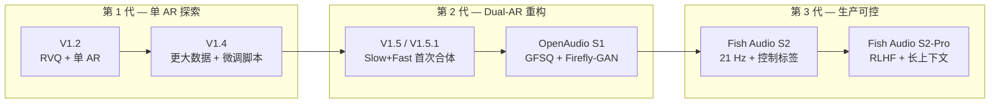

## 前置知识

> [!important]
> 
> 阅读本章前建议先了解：[[2. 核心架构：Dual-AR（双自回归）]]、[[3. 语音 Tokenizer：GFSQ]]、[[4. 声码器：Firefly-GAN（FFGAN）]]。本章按时间线串起各版本的关键设计变化，许多细节在后续章节展开。

---

## 1.0 定位

> 一句话：本章是 Fish-Speech / OpenAudio / Fish Audio 全系列的**演进谱系图**——它回答「为什么会出现 Dual-AR？为什么从 V1.x 改名为 S1？S2 又重写了什么？」三个根本问题，是所有后续章节的时间线锚点。

---

## 1.1 版本谱系一览

下面的对比表把整个系列按**架构代际**拆为三代：

|代际|代表版本|发布时间|核心架构|语音 Tokenizer|声码器|主要突破|
|---|---|---|---|---|---|---|
|**第 1 代（探索）**|V1.2 / V1.4|2024 H1|单 AR + Codec|VQ-GAN（RVQ）|VQ-GAN 内置|零样本中英克隆能力建立基线|
|**第 2 代（重构）**|V1.5 / OpenAudio S1|2024 H2 – 2025 Q2|**Dual-AR**（Slow + Fast）|**GFSQ**（GVQ + FSQ）|**Firefly-GAN v1**|首包延迟降到 ~150 ms，13 语种统一建模|
|**第 3 代（生产）**|Fish Audio S2 / S2-Pro|2025 Q3 – 2026|Dual-AR + 控制标签|GFSQ-v2 (21 Hz)|Firefly-GAN v2|情感/口音/笑声/呼吸的可控合成、TTS-Arena ELO 顶部|

> [!important]
> 
> **记忆锚点**：V1.x = 单 AR；V1.5 = 双 AR 首次出现；S1 = 双 AR 工程化收敛；S2 = 双 AR 加可控性扩展。

---

## 1.2 演进路线图

---

## 1.3 三个根本问题

### Q1：为什么从单 AR 进化到 Dual-AR？

单 AR 模型在 75 Hz 的高 token rate 下，**首包延迟（TTFB）随文本长度线性增长**：长文本一句话开头听到声音可能需要 1.5 s 以上。Dual-AR 把语义层（Slow）与声学层（Fast）解耦：Slow 只输出语义 token（21 Hz，频率降低 3.5×），Fast 把每个语义 token 展开为 8 个 codebook（详见 [[2. 核心架构：Dual-AR（双自回归）]]）。这是**硬件约束驱动的架构变化**——不是为了好看，是为了在 RTX 4090 上把 TTFB 压到 150 ms 以下。

### Q2：为什么 V1.5 之后改名 OpenAudio S1？

V1.5 的 GFSQ + Dual-AR 已经收敛，团队把项目重定位为「Open Audio Foundation Model」，强调多语种与基础模型属性。**这不是 marketing rebrand**——S1 重新训练了 tokenizer（FSQ 8×1024 替换 RVQ），权重不兼容 V1.x。

### Q3：S2 在 S1 基础上做了什么？

S2 引入**控制标签体系**（详见 [[9. 可控性能力]]），让 `(laugh)`、`(sigh)`、`(angry)` 直接进入文本 prompt；并把 token rate 从 25 Hz 进一步降到 21 Hz，把 TTFB 再压一档。S2-Pro 在 S2 基础上叠加 RLHF 与更长上下文。

---

## 1.4 工程判断：现在应该选哪个版本？

> [!important]
> 
> **优先级链**：先用 **S1**（最稳定开源权重） → 再评估 **S2** 是否需要控制标签 → 商业部署直接走 **S2-Pro API**。
> 
> - 学术复现 / 自训练：S1（OpenAudio 仓库公开训练脚本）
> 
> - 生产部署但要本地化：S1 + 自蒸馏 LoRA
> 
> - 需要笑声 / 情感 / 多说话人 dialogue：必须 S2 起步
> 
> - 不想自己运维：S2-Pro API

---

## 1.5 常见误区

> [!important]
> 
> **误区 1**：「V1.5 和 S1 只是改名」——错。S1 重写了 tokenizer 与 vocoder，权重不互通。
> 
> **误区 2**：「token rate 越低越好」——错。21 Hz 已经接近 codec 信息量下限，再低会拖累音色细节，详见 [[3.5 21Hz - 42Hz Token Rate 选型]]。
> 
> **误区 3**：「S2 是 S1 的微调」——错。S2 重训了 GFSQ-v2 与 Firefly-GAN v2，是 from-scratch 训练。

---

## 1.6 子页面导航

[[1.1 Fish-Speech V1.2]]

---

[[1.4 OpenAudio S1]]

[[1.2 Fish-Speech V1.4]]

1. Fish-Speech GitHub Repository, `fishaudio/fish-speech`, commit history 2024-04 ~ 2026-05.

[[1.6 Fish Audio S2-Pro]]

1. Fish Audio Blog, _Introducing S2 and S2-Pro_, 2025-Q3.

[[1.3 Fish-Speech V1.5 - V1.5.1]]

1. OpenAudio S1 Model Card, HuggingFace `fishaudio/openaudio-s1-mini`, 2025.

[[1.5 Fish Audio S2]]

[[1.7 许可证演进（CC-BY-NC-SA 4.0）]]

## 参考文献

1. Fish Audio 团队. _Fish-Speech: Leveraging Large Language Models for Advanced Multilingual Text-to-Speech Synthesis_. 2024.