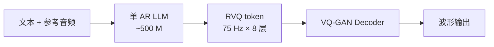

## 前置知识

> [!important]
> 
> 阅读本页前建议先读：[[1. 版本谱系与演进路线]]（理解 V1.2 在三代谱系中的位置）。

---

## 1.1.0 定位

> 一句话：V1.2 是 Fish-Speech 系列**对外公开的第一个稳定版本**，确立了「文本 LLM + 神经 Codec + AR 解码」的整体范式，但还是**单 AR + 75 Hz RVQ**，是后续所有改良的起点参照。

---

## 1.1.1 关键信息

|项目|V1.2 配置|
|---|---|
|发布时间|2024 年 4 月|
|骨干 LLM|自研 Llama-style，~500 M 参数|
|Tokenizer|VQ-GAN（RVQ，8 层，75 Hz）|
|声码器|VQ-GAN 内置 Decoder|
|支持语言|中文 / 英文|
|克隆方式|3–5 s 参考音频零样本|
|许可证|CC-BY-NC-SA 4.0|

---

## 1.1.2 架构示意

---

## 1.1.3 V1.2 解决了什么

- **零样本中英克隆基线**：建立了 3 s 参考音频即可克隆的可用基线。

- **开源完整训练栈**：首次公开数据预处理 → tokenizer 训练 → LLM 训练 → 推理脚本的完整链路。

- **CC-BY-NC-SA 4.0**：允许学术与个人非商用使用，详见 [[1.7 许可证演进（CC-BY-NC-SA 4.0）]]。

---

## 1.1.4 V1.2 的局限

> [!important]
> 
> 1. **首包延迟高**：75 Hz × 8 层 = 600 token/s，1 s 音频需要 600 步 AR 前向，4090 上 TTFB 约 800 ms。
> 
> 1. **多语种乏力**：仅训练中英，遇到日韩文本会回退到拼读，质量塌方。
> 
> 1. **音色漂移**：长文本生成中 AR 容易遗忘 prompt 音色，60 s+ 出现明显偏差。
> 
> 1. **RVQ 训练不稳**：codebook 利用率约 70%，需要 EMA + codebook restart 维持。

这四点正是 V1.5 / S1 / S2 三代演进的直接驱动力。

---

## 1.1.5 工程判断：今天还能用 V1.2 吗？

> [!important]
> 
> **不建议**用于任何新项目。V1.2 的 TTFB、音色稳定性、多语种能力均被 S1 全面超越，且权重已被官方标注 deprecated。仅当做版本对照基线 / 教学复现实验时使用。

---

## 延伸阅读

- [[1.2 Fish-Speech V1.4]]：V1.2 的直接继任，主要是数据扩量。

- [[1.3 Fish-Speech V1.5 - V1.5.1]]：架构换代的转折点。

---

## 参考文献

1. Fish Audio. _Fish-Speech V1.2 Release Notes_, GitHub `fishaudio/fish-speech`, 2024-04.

1. Fish-Speech 仓库 tag `v1.2`，`tools/llama/generate.py` 推理脚本。